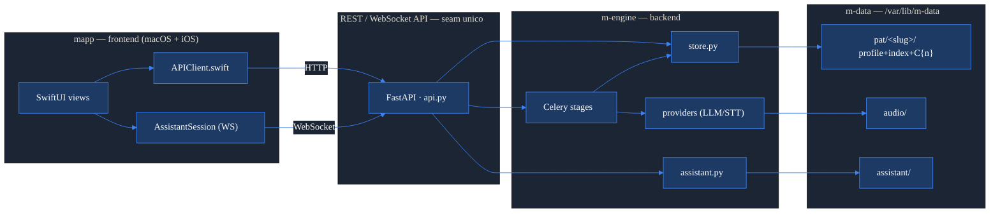
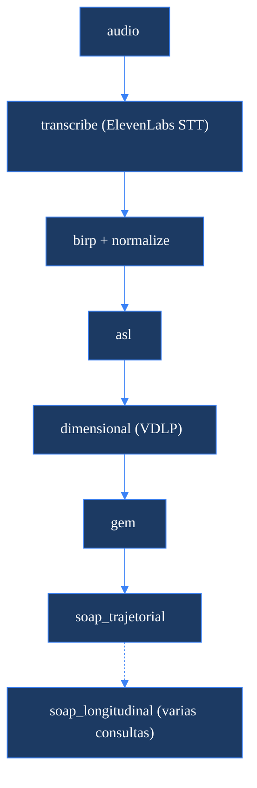

# Arquitetura — mapp + m-engine

## Visão geral

O sistema tem dois produtos com fronteira nítida: **mapp** — o app SwiftUI (macOS + iOS, fontes compartilhadas em `ui-swift/`) — e **m-engine** — o backend Python (API FastAPI + pipeline Celery + store em arquivos). O **mapp** consome *exclusivamente* a API REST/WebSocket do **m-engine**; nunca toca no sistema de arquivos nem em PHI diretamente. Toda a computação clínica (transcrição → análise linguística → documentos) roda no worker Celery do m-engine, e os dados vivem em **m-data** (`M_BASE = /var/lib/m-data` na VM). A API é o **único seam** entre os dois mundos: é o contrato estável que o mapp depende, e a barreira que mantém o PHI confinado à VM.

## Mapa de módulos e o seam

```
mapp  ⇄  REST/WS API  ⇄  m-engine  ⇄  m-data
```

| Camada | O que é | Onde |
| --- | --- | --- |
| **mapp** (frontend) | App SwiftUI macOS + iOS, fontes compartilhadas. Consome a API por HTTP (`APIClient`) e WebSocket (`AssistantSession`). | `ui-swift/MEngine/` (SwiftPM `Package.swift` → macOS; `project.yml`/xcodegen → iOS) |
| **REST/WS API** (o seam) | FastAPI: orquestração apenas — enfileira jobs, serve dossiês, ponte do assistente. Sem lógica de negócio. | `m_engine/api.py` |
| **m-engine** (backend) | Stages Celery (a computação), store (modelo de dados em arquivos), providers (LLM/STT), assistente agêntico. | `m_engine/stages/`, `m_engine/store.py`, `m_engine/providers/`, `m_engine/assistant.py`, `m_engine/tasks.py` |
| **m-data** (dados) | Dossiês por paciente, áudio de entrada, transcript do assistente. PHI confinado à VM. | `M_BASE` = `/var/lib/m-data` |

### Regras de fronteira (objetivas)

- **mapp consome SOMENTE a API.** Não há acesso a disco/PHI a partir do app; toda leitura/escrita de dossiês passa por endpoints.
- **A API é o único seam.** É a camada de orquestração: valida entrada, enfileira no Celery e lê/escreve o store. Nenhuma regra clínica vive aqui.
- **PHI fica na VM.** Os arquivos (`pat/`, `audio/`, `assistant/`) só existem em `M_BASE` na VM; o app só vê o que a API devolve.



## Modelo de dados (m-data)

`M_BASE` (`/var/lib/m-data`) organiza tudo em torno de **paciente → consultas → artefatos**:

```
M_BASE/
  professional.json          perfil unico do clinico ativo (assinatura, CRM/RQE)
  pat/<slug>/
    profile.json             identidade EDITAVEL (nome, CPF, telefone, idade, e-mail, notas)
    index.json               mantido pela maquina: consultas C{n} + clinical_summary
    C1/                       uma pasta por consulta (data nos metadados do index.json)
      transcription.json
      BIRP.md   BIRP.json
      ASL.json  DIMENSIONAL.json  GEM.json
      SOAP_trajetorial.md
    C2/ … C3/ …
    longitudinal/            SOAP longitudinal (cobre varias consultas)
  audio/                     entrada do STT (upload via POST /audio)
  assistant/general.json     transcript persistente do assistente geral
  _trash/                    soft-delete: nada e apagado de verdade
```

- O **`slug`** é um identificador legível e estável derivado do nome na criação; corrigir o nome de exibição em `profile.json` **não** muda o slug nem quebra caminhos.
- As consultas são pastas `C{n}` numeradas por ordem de inserção; o mapeamento data → `C{n}` vive em `index.json`.
- Exclusões são **soft-delete**: pacientes/consultas/documentos vão para `_trash/`, nunca `rm`.

## Pipeline clínico

Disparado por `POST /jobs/pipeline` (uma sessão a partir do áudio). Roda síncrono no worker, sob um único `job_id` que o mapp acompanha. **A nota BIRP roda logo após a transcrição**, em paralelo conceitual ao ramo de análise profunda:

```
transcribe → birp + normalize → asl → dimensional → gem → soap_trajetorial
```

- **transcribe** — STT (ElevenLabs) sobre o áudio → `transcription.json`.
- **birp** — nota clínica imediata (`BIRP.md` / `BIRP.json`); também estabelece o dossiê.
- **normalize** — normaliza a transcrição e cria/atualiza o dossiê (resolve slug + consulta).
- **asl** — Análise Sistêmica Linguística → `ASL.json`.
- **dimensional** — Perfil Dimensional (VDLP) → `DIMENSIONAL.json`.
- **gem** — Grafo do Espaço Mental → `GEM.json`.
- **soap_trajetorial** — nota SOAP de uma sessão → `SOAP_trajetorial.md`.
- **soap_longitudinal** — nota SOAP cobrindo várias consultas (disparo separado, sobre datas).

Com `deep=false`, o pipeline para após `normalize`. Modelo default: Claude Opus 4.8 para `asl`/`dimensional`/`gem`; Claude Sonnet 4.6 para `normalize`/`birp`/SOAPs (`M_FORCE_MODEL` força um único modelo em todos os stages — ex.: `cc` para rodar 100% na assinatura Claude Code).



## Fluxo típico — nova consulta → pipeline → documentos

```mermaid
%%{init: {'theme':'base','themeVariables':{'primaryColor':'#1C3A63','primaryTextColor':'#ffffff','primaryBorderColor':'#3B82F6','lineColor':'#3B82F6','actorBkg':'#1C3A63','actorTextColor':'#ffffff','signalColor':'#1C2533','fontFamily':'-apple-system, Helvetica, sans-serif'}}}%%
sequenceDiagram
  participant U as mapp (UI)
  participant A as API (api.py)
  participant Q as Celery
  participant S as store / m-data

  U->>A: POST /audio (upload)
  A->>S: grava em audio/
  A-->>U: { path }
  U->>A: POST /jobs/pipeline { audio_path }
  A->>Q: enqueue pipeline_task
  A-->>U: { job_id }
  Q->>Q: transcribe -> birp + normalize -> asl -> dim -> gem -> soap
  Q->>S: grava artefatos em pat/&lt;slug&gt;/C{n}/
  loop polling
    U->>A: GET /jobs/{job_id}
    A-->>U: { status, result }
  end
  U->>A: GET /patients/{slug}/consultations
  A->>S: le index.json + C{n}/*.md
  A-->>U: consultas + documentos
```

## Forma de deploy

Runtime no host de uma VM, dois serviços systemd rodando como o usuário `ubuntu` (para que o provider `cc` reaproveite a auth da assinatura Claude Code):

- **`m-engine-api.service`** — `uvicorn m_engine.api:app --host ${M_API_HOST} --port ${M_API_PORT}`. O `M_API_HOST` é o **IP da Tailscale** (API privada na tailnet); o app conecta por aí.
- **`m-engine-worker.service`** — `celery -A m_engine.tasks worker --concurrency=2`. Executa os stages longos.
- **Redis** local como broker/backend Celery (`REDIS_URL`).
- **Segredos e config** vêm de `/etc/m-engine.env` (modo 0600, fora do git): `M_BASE`, `ELEVENLABS_API_KEY`, `REDIS_URL`, `M_API_HOST`, `M_FORCE_MODEL`, `M_CLAUDE_CLI_BIN`.
- **Hardening (PHI):** `ProtectSystem=strict`, `NoNewPrivileges`, `UMask=0077`; único caminho gravável fora de `/home` é o volume de dados `/var/lib/m-data`.

## Nota — modularização futura

A **API é a linha de corte limpa.** Hoje `mapp` e `m-engine` convivem no mesmo repositório, mas o frontend só conhece o contrato HTTP/WS de `api.py` (documentado em [`docs/API.md`](docs/API.md)). Por isso o **mapp** pode virar um repositório próprio mais tarde, dependendo apenas desse contrato — sem nenhum acoplamento ao Python, ao store ou ao layout de `m-data`. Manter a API magra (orquestração, sem regra clínica) é o que preserva essa possibilidade.
