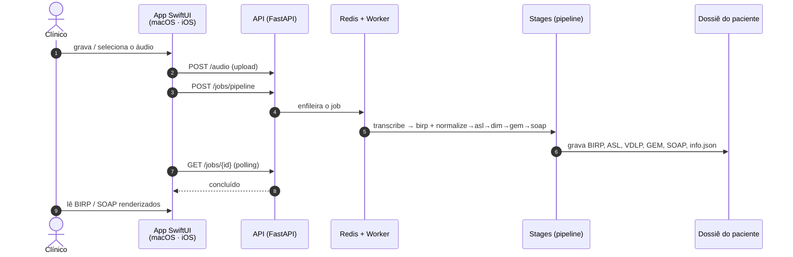
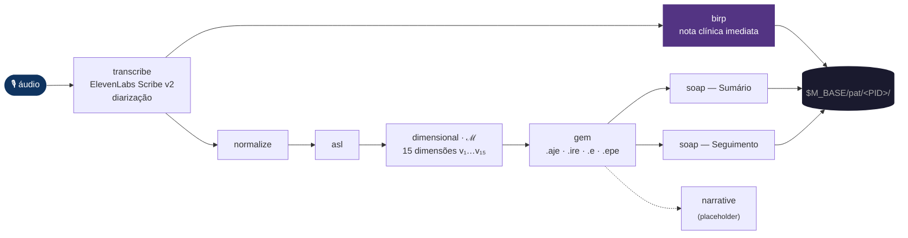
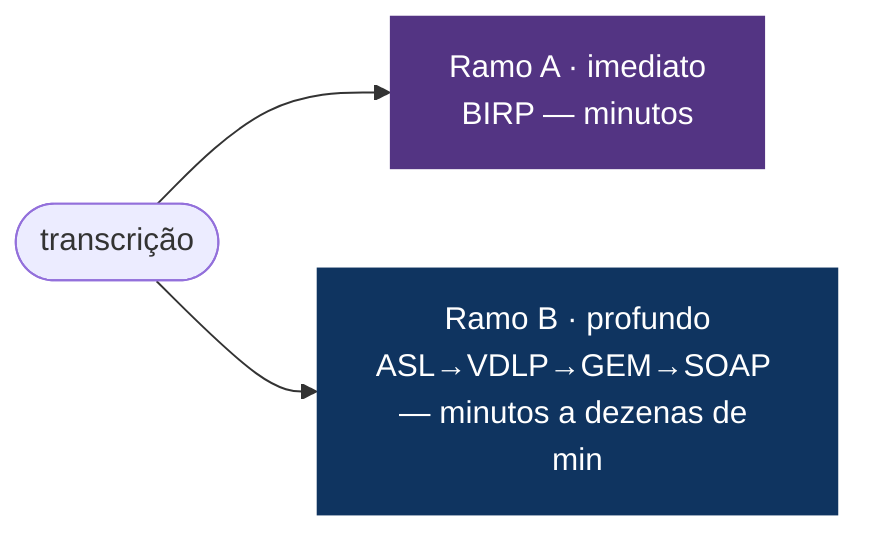
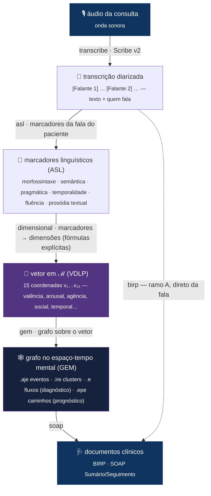
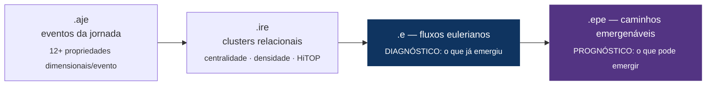
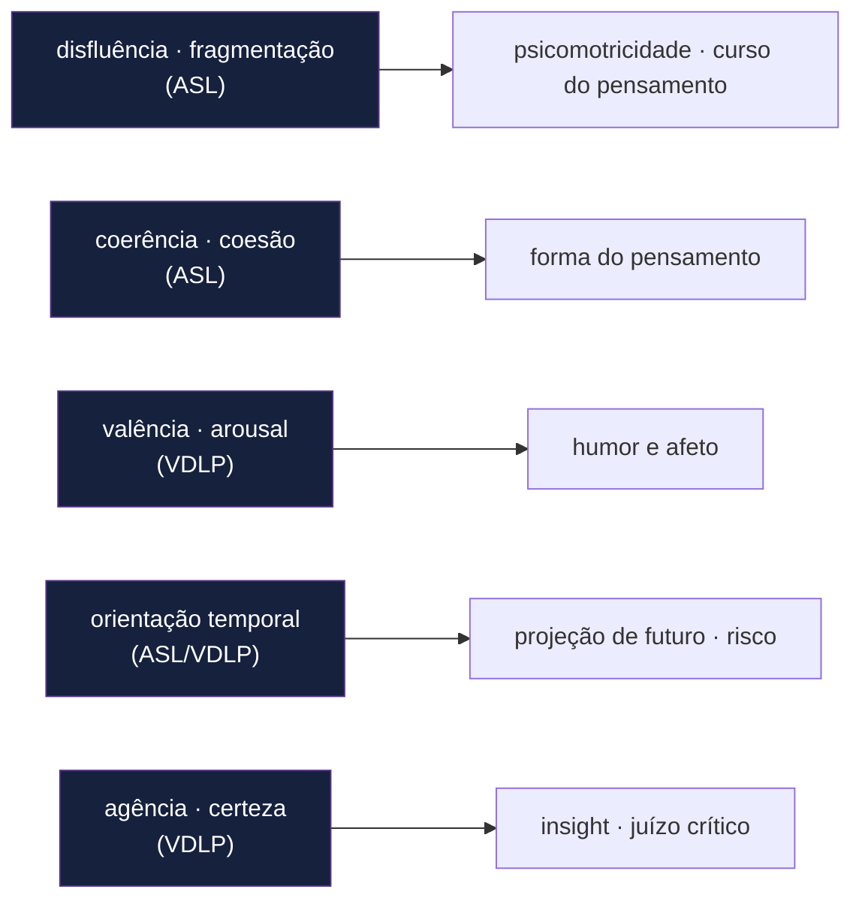
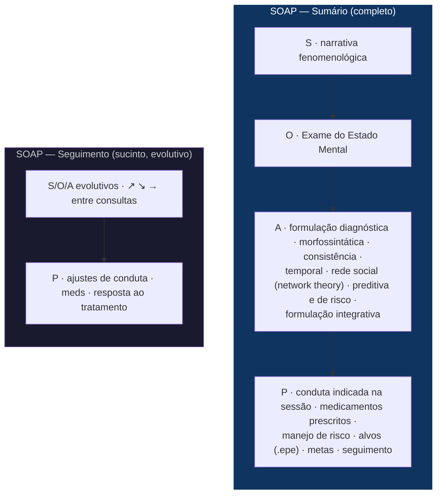
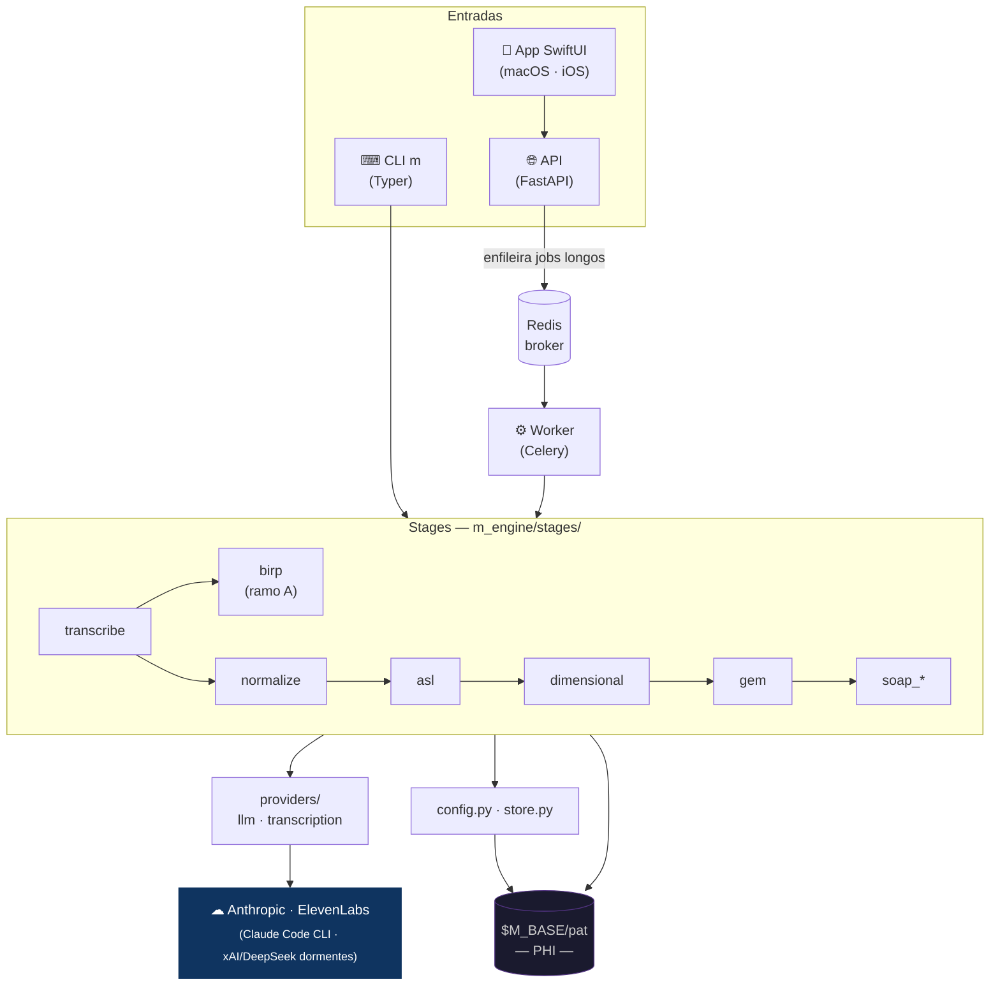
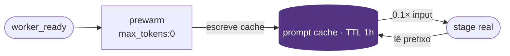
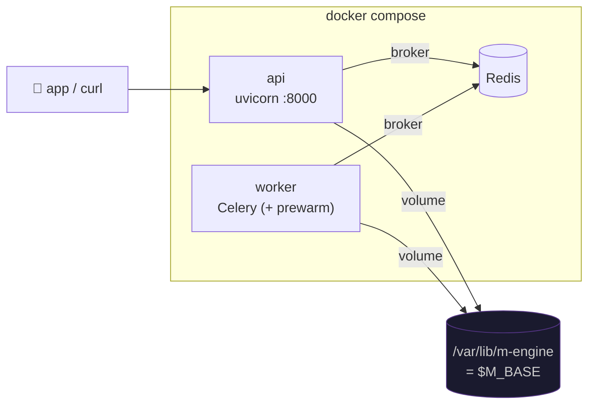

<div align="center">
  
  <h1>M-Engine</h1>
  <p><strong>Da fala da consulta a documentos clínicos estruturados — passando por um manifold do estado mental.</strong></p>
  <p>
    
    
    
    
    
  </p>
</div>

---

O M-Engine recebe o **áudio de uma sessão clínica** e o transforma em **documentos clínicos**
(nota BIRP imediata, SOAP) ancorados em análise linguística mensurável. A partir da
**transcrição diarizada**, o fluxo se abre em **dois ramos paralelos**:

- **Ramo A — BIRP** (`transcribe → birp`): nota clínica **imediata** (Behavior · Intervention · Response · Plan), feita só com a transcrição. É também quem cria/atualiza o dossiê e o `info.json`.
- **Ramo B — Espaço Mental ℳ** (`transcribe → normalize → ASL → dimensional → GEM → SOAP`): a análise profunda em camadas que projeta a fala no **manifold ℳ** e gera a nota SOAP.

Chamadas **diretas** aos providers (sem gateway). Default **Claude Opus 4.8** (Anthropic);
transcrição via **ElevenLabs Scribe v2** (diarizado, sem timestamps). Há um alias `cc` que roteia
via **Claude Code CLI** (reaproveita a auth do sistema). Os dados de cada paciente (**PHI**) ficam
em `$M_BASE/pat`, em volume dedicado.

---

## Visão em 30 segundos

A jornada de uma consulta — do gravador ao prontuário:



---

## Pipeline

<div align="center">
  
  <br/><sub>mental space M — o espaço topológico que o pipeline percorre</sub>
</div>

<br/>

### Os dois ramos



**Por que dois ramos.** O **Ramo A (BIRP)** entrega uma nota clínica em minutos, logo após a
transcrição — é uma *folha* (não alimenta o Ramo B). O **Ramo B** faz a análise profunda
(ASL → VDLP → GEM → SOAP). Ambos partem da mesma transcrição; o BIRP roda primeiro só porque
estabelece o dossiê/`info.json` que o Ramo B reutiliza.



### Stages

| Stage              | Default | Entrada                  | Saída em `$M_BASE/pat/<PID>/`                        |
|--------------------|---------|--------------------------|------------------------------------------------------|
| `transcribe`       | —       | arquivo de áudio         | `audio/transcriptions/*.json` + `.txt`               |
| `birp` *(ramo A)*  | sonnet  | transcrição (só a fala)  | `clinical-documents/<PID>_BIRP_*.md` + `.json` + cria dossiê/`info.json` |
| `normalize`        | sonnet  | transcrição JSON         | cria/atualiza dossiê + `transcriptions/`             |
| `asl`              | opus    | dossiê + data            | `linguistic-analysis/<PID>_<DATE>_ASL.json`          |
| `dimensional`      | opus    | ASL                      | `dimensional-analysis/<PID>_<DATE>_DIMENSIONAL.json` |
| `gem`              | opus    | dimensional              | `gem/<PID>_<DATE>_GEM.json`                          |
| `soap_trajetorial` | sonnet  | transcrição + ASL/VDLP/GEM | `clinical-documents/<PID>_SOAP_TRAJETORIAL_*.md` → **SOAP — Sumário** |
| `soap_longitudinal`| sonnet  | artefatos de várias datas  | `clinical-documents/<PID>_SOAP_LONG_*.md` → **SOAP — Seguimento** |

Identidade do paciente: `PATIENT_ID = PAT_<INICIAIS>_<NN>` (sequencial), em `m_engine/store.py`.
Cada stage é **idempotente** (pula reprocessamento se o artefato existir e `force=False`; análise
profunda invalida o cache por `analysis_version`).

---

## Da fala à estrutura

Cada stage **muda a representação** do mesmo conteúdo — de onda sonora a um documento clínico
ancorado em coordenadas mensuráveis:



| De → Para | Stage | O que acontece |
|---|---|---|
| áudio → texto | `transcribe` | Diarização por falante (`[Falante N]`), sem timestamps; JSON + `.txt`. |
| texto → nota imediata | `birp` | Lê **só a transcrição**; extrai **B**/**I**/**R**/**P** + metadados clínicos (ICD, medicações, tópicos) e atualiza o `info.json`. |
| texto → dossiê | `normalize` | Identifica paciente/profissional, padroniza terminologia (AHDI), salva o **diálogo completo**. |
| texto → marcadores | `asl` | Análise psicolinguística da fala do paciente em **8 domínios / 11 categorias** — contagens, índices (TTR, conectivos, atos de fala, modalização, disfluências…) **com citações literais**. |
| marcadores → vetor | `dimensional` | Projeta a ASL nas **15 dimensões de ℳ** (`v₁…v₁₅`), cada uma com **fórmula explícita e rastreável** (RDoC/HiTOP/Big Five/PERMA). A sessão vira um **ponto/estado** em ℳ. |
| vetor → grafo | `gem` | Constrói o **grafo** sobre ℳ (abaixo). |
| grafo+transcrição → documento | `soap_*` | Redige a nota clínica ancorada em todas as camadas + na transcrição. |

---

## O manifold ℳ — como e por quê

**ℳ é um espaço vetorial de 15 dimensões** — o "Espaço Mental". Cada dimensão (`v₁…v₁₅`) é uma
**coordenada psicométrica** do estado do paciente (valência, arousal, agência, orientação
temporal, integração social, complexidade cognitiva, coerência narrativa…).

**Por quê.** A linguagem é a janela observável do estado mental. Em vez de uma impressão difusa,
o M-Engine reduz o discurso a um **ponto em ℳ** — e a sessão a uma **trajetória**. Isso torna o
estado **mensurável, comparável** (entre sessões e entre pacientes) e **rastreável**: cada
coordenada vem de uma fórmula sobre marcadores linguísticos concretos, não de um palpite. Os
eixos são ancorados em frameworks validados (RDoC, HiTOP, Big Five, PERMA).

**Como (ASL → VDLP → GEM):**

1. **ASL** extrai os *marcadores* observáveis da fala (quantitativos + exemplos literais).
2. **VDLP** aplica fórmulas marcador → dimensão e produz o **vetor `v₁…v₁₅`**, com
   `valores_asl_extraidos` e `componentes_asl_usados` para auditoria. É o **ponto em ℳ**.
3. **GEM** trata a sessão como um **campo de eventos no espaço-tempo mental** — um grafo de 4 camadas:



**Atrito vs. alavancagem.** O sofrimento e a potência terapêutica aparecem como **clusters de
atrito** (escalada, perda) versus **clusters de alavancagem** (aliança, esperança, recursos). Os
fluxos `.e` descrevem o que **já** emergiu (diagnóstico); os caminhos `.epe` descrevem o que
**pode** emergir — como canalizar a energia do atrito para a alavancagem (prognóstico e plano).

---

## Documentos clínicos

### A linguagem vira Exame do Estado Mental

Os marcadores da ASL não são números soltos: alimentam **achados objetivos** do EEM na nota SOAP.



### Anatomia da nota

A nota SOAP é **narrativa-fenomenológica** com CID-10/DSM-5 e EEM construído **a partir da
transcrição**. Duas variantes, mesma filosofia:



- **Conduta real da consulta.** A seção P extrai da fala do **médico** na transcrição o que ele
  indicou (medicamentos prescritos/suspensos/ajustados com doses, exames, encaminhamentos,
  retorno) e a documenta explicitamente.
- **Evidência, não dashboard.** ASL/VDLP/GEM sustentam os achados (citações + dimensões em prosa
  parcimoniosa). Sem barras, sem "escala 0-5", sem branding — apenas `© 2026 IREAJE` no rodapé.

---

## Arquitetura



### Dossiê do paciente

```
$M_BASE/
├── audio/
│   └── transcriptions/        ← <base>_transcription.json + .txt
└── pat/<PID>/
    ├── info.json              ← identidade + sessions[] + clinical_summary
    ├── transcriptions/        ← <DATE>_transcription.json (diálogo completo)
    ├── linguistic-analysis/   ← <PID>_<DATE>_ASL.json
    ├── dimensional-analysis/  ← <PID>_<DATE>_DIMENSIONAL.json
    ├── gem/                   ← <PID>_<DATE>_GEM.json
    └── clinical-documents/    ← <PID>_BIRP_*.md · _SOAP_*.md (+ JSON do BIRP)
```

### Árvore de módulos

```
m_engine/
├── cli.py · api.py · tasks.py     ← superfícies (CLI / API / fila Celery)
├── prewarm.py                     ← pré-aquecimento do prompt cache
├── config.py · store.py · util.py ← config/modelos · dossiê · helpers
├── providers/  (llm · transcription)
├── schemas/    (Pydantic v2)
├── stages/     (um módulo por stage; contratos em __init__)
└── prompts/    (system prompts .md por stage)
```

---

## Prompt caching & pré-aquecimento

Os **system prompts são gigantes e estáveis** (teoria da ASL, framework do GEM) e dominam o custo
de input. O M-Engine os cacheia (TTL **1h** por padrão) e os **pré-aquece** no boot do worker, de
modo que a 1ª chamada real de cada stage já leia a **0.1×**.



- `M_CACHE_TTL` (`5m` | `1h`, default `1h`); cada chamada loga `cache_hit`/`cache_read`/`cache_write`.
- `m warm` aquece sob demanda; o worker aquece sozinho no boot.
- O ganho aparece em **lote/reprocessamento** dentro do TTL (num paciente avulso, paga-se a escrita uma vez).

---

## Instalação

Requer **Python 3.11+**.

```bash
git clone https://github.com/myselfgus/m.git m-engine && cd m-engine
python3.11 -m venv .venv && source .venv/bin/activate
pip install .          # instala o pacote e o entrypoint `m`
```

## Configuração (`.env`)

```bash
cp .env.example .env   # preencha as chaves — .env não vai ao git
```

| Variável             | Descrição                                                            |
|----------------------|----------------------------------------------------------------------|
| `M_BASE`             | Raiz dos dados (`$M_BASE/pat`, `$M_BASE/audio`).                    |
| `ANTHROPIC_API_KEY`  | Provider default (Claude).                                           |
| `ELEVENLABS_API_KEY` | Transcrição (Scribe v2).                                            |
| `M_DEFAULT_MODEL`    | Aliases ativos: `opus` (default global), `sonnet`, `cc` (Claude Code CLI). |
| `M_CACHE_TTL`        | TTL do prompt cache: `5m` ou `1h` (default `1h`).                   |
| `M_CLAUDE_CLI_BIN`   | Binário do Claude Code para o alias `cc` (default `claude`).        |
| `REDIS_URL`          | Broker/result-backend do Celery.                                    |
| `M_API_HOST` · `M_API_PORT` | Default `0.0.0.0` · `8000`.                                  |
| `XAI_API_KEY` · `DEEPSEEK_API_KEY` | Opcionais — providers **dormentes** (sem alias ativo).  |

**Defaults por stage** (`config.STAGE_DEFAULTS`): `birp`, `normalize`, `soap_*` → **`sonnet`**;
`asl`, `dimensional`, `gem` → **`opus`** (Claude Opus 4.8: 128K saída / janela 1M, streaming,
adaptive thinking). O alias `cc` roteia via **Claude Code CLI** (auth do sistema, sem API key).

---

## Uso — CLI `m`

```bash
m ingest /caminho/sessao.m4a          # ponta a ponta (use --no-deep p/ parar no normalize)
m warm                                # pré-aquece o prompt cache

# passo a passo
m transcribe /caminho/sessao.m4a
m birp       $M_BASE/audio/transcriptions/2026-06-22_transcription.json   # ramo A
m normalize  $M_BASE/audio/transcriptions/2026-06-22_transcription.json   # ramo B
m asl PAT_GDP_01 2026-06-22  &&  m dimensional PAT_GDP_01 2026-06-22  &&  m gem PAT_GDP_01 2026-06-22
m soap      PAT_GDP_01 2026-06-22                  # SOAP — Sumário (uma consulta)
m soap-long PAT_GDP_01 2026-06-01 2026-06-22       # SOAP — Seguimento (várias consultas)

m asl PAT_GDP_01 2026-06-22 --model cc --force     # override de modelo + reprocessa
```

## Uso — API & App

| Método | Rota | Função |
|---|---|---|
| `POST` | `/audio` | Upload de áudio (multipart) → grava em `$M_BASE/audio`. |
| `POST` | `/jobs/pipeline` | Pipeline completo de uma sessão num **único job**. |
| `POST` | `/jobs/{stage}` | Enfileira um stage isolado. |
| `GET`  | `/jobs/{id}` | Status/resultado (polling). |
| `GET`  | `/patients` · `/patients/{id}/documents` · `/.../documents/{nome}` · `/.../info` | Navegar dossiês e ler BIRP/SOAP. |
| `GET`  | `/healthz` | Liveness. |

```bash
curl -F file=@sessao.m4a http://localhost:8000/audio
curl -X POST http://localhost:8000/jobs/pipeline -H 'content-type: application/json' \
  -d '{"audio_path":"/var/lib/m-engine/audio/sessao.m4a","deep":true}'
```

### App SwiftUI (macOS · iOS)

<div align="center">
  
  <br/><sub>o app usa o ícone <code>m-icon</code> (assets/) — <code>ui-swift/MEngine/AppIcon.icns</code></sub>
</div>

Cliente multiplataforma em [`ui-swift/`](ui-swift/): **gravar/selecionar áudio → enviar → disparar
o pipeline → acompanhar o job → ler BIRP/SOAP** renderizados. No macOS roda direto via SwiftPM:

```bash
cd ui-swift && swift build && swift run        # janela do app (aponta p/ http://localhost:8000)
```

Para iOS e distribuição assinada, monte o projeto Xcode multiplataforma e adicione o `m-icon` ao
`Assets.xcassets/AppIcon` — passo-a-passo, Info.plist (microfone), entitlements e ATS em
[`ui-swift/README.md`](ui-swift/README.md).

---

## Deploy

### Docker Compose

```bash
cp .env.example .env
export M_BASE=/srv/m-engine/data   # volume PHI (cifrado) — obrigatório
docker compose -f deploy/docker-compose.yml up -d --build
```

Sobe `redis`, `api` (uvicorn `:8000`) e `worker` (Celery), compartilhando o volume `$M_BASE`
em `/var/lib/m-engine`. O worker **pré-aquece o prompt cache** ao subir.



### systemd (VM de produção)

Unidades em `deploy/systemd/` (usuário `mengine`, `EnvironmentFile=/etc/m-engine.env`,
`Restart=always`, hardening). Logs: `journalctl -u m-engine-api -f`.

---

## Segurança & PHI

<div align="center">
  
  <br/><sub>dados sob <code>$M_BASE/pat</code> são PHI — trate como ambiente clínico</sub>
</div>

<br/>

- **Criptografia em repouso** do volume `$M_BASE` (LUKS/dm-crypt ou volume gerenciado); backups cifrados.
- **Segredos só em env / secret manager**; `.env` no `.gitignore`; o `compose` **exige** `M_BASE` (sem default silencioso).
- **API não exposta à internet**: reverse proxy com TLS + auth; `:8000` na rede interna; Redis sem porta pública.
- **Privilégio mínimo**: containers/serviços como `mengine` (não-root); systemd com `ProtectSystem=strict`, `NoNewPrivileges`, `UMask=0077`.
- **Retenção e anonimização**: `PATIENT_ID = PAT_<INICIAIS>_<NN>` reduz exposição; limpe `$M_BASE/_debug` periodicamente.

---

<div align="center">
  
  <br/><br/>
  <sub><em>mental space manifold</em> · © 2026 IREAJE</sub>
</div>
