<div align="center">
  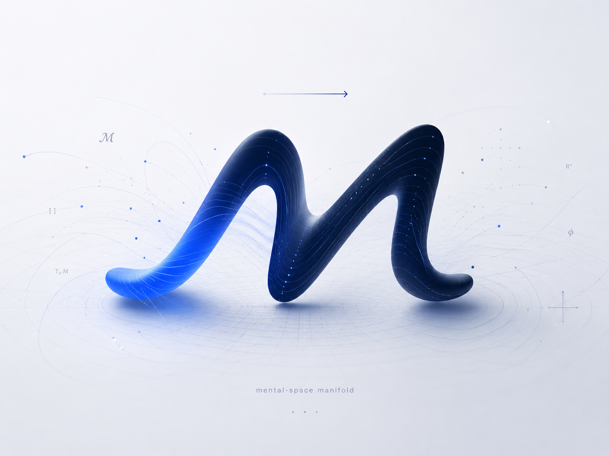
  <h1>M-Engine</h1>
  <p><strong>Da fala da consulta a documentos clínicos estruturados — passando por um manifold do estado mental.</strong></p>
  <p>
    
    
    
    
    
    
    
  </p>
</div>

---

O M-Engine recebe o **áudio de uma sessão clínica** e o transforma em **documentos clínicos**
(nota BIRP imediata, SOAP) ancorados em análise linguística mensurável. A partir da
**transcrição diarizada**, o fluxo se abre em **dois ramos paralelos**:

- **Ramo A — BIRP** (`transcribe → birp`): nota clínica **imediata** (Behavior · Intervention · Response · Plan), feita só com a transcrição. É também quem cria/atualiza o dossiê e o `info.json`.
- **Ramo B — Espaço Mental ℳ** (`transcribe → normalize → ASL → dimensional → GEM → SOAP`): a análise profunda em camadas que projeta a fala no **manifold ℳ** e gera a nota SOAP.

Chamadas **diretas** aos providers (sem gateway). O **pipeline** roda em **Claude Opus 4.8**
(Anthropic) por padrão; o **assistente clínico** do app conversa em **Claude Sonnet 4.6** (janela
de **1M**) de forma agêntica e persistente. Transcrição via **ElevenLabs Scribe v2** (diarizado,
sem timestamps). Há um alias `cc` que roteia o pipeline via **Claude Code CLI** (reaproveita a auth
do sistema, sem crédito de API). Os dados de cada paciente (**PHI**) ficam em `$M_BASE/pat`, em
volume dedicado.

> **Como ler este README.** Os diagramas **são** o design system: cada nó colorido usa o **mesmo
> tint** que o stage tem no app — STT slate, PROC azul, ASL índigo, VDLP violeta, GEM verde, SOAP
> navy, PHI ink. A paleta canônica está em [Design System](#design-system-healthos).

---

## Visão em 30 segundos

A jornada de uma consulta — do gravador ao prontuário:

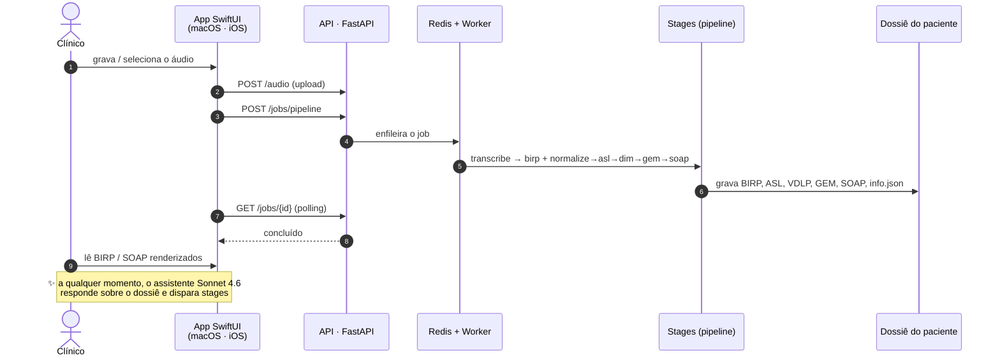

---

## Pipeline

<div align="center">
  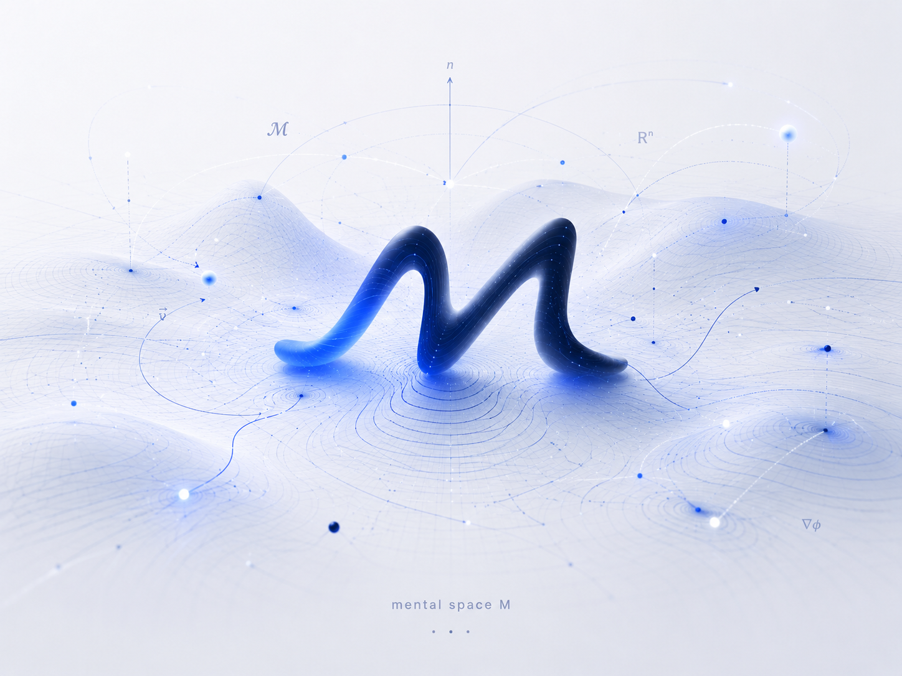
  <br/><sub>mental space ℳ — o espaço topológico que o pipeline percorre</sub>
</div>

<br/>

### Os dois ramos

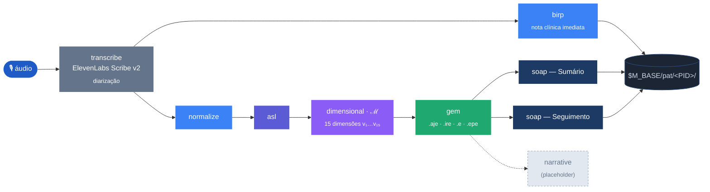

**Por que dois ramos.** O **Ramo A (BIRP)** entrega uma nota clínica em minutos, logo após a
transcrição — é uma *folha* (não alimenta o Ramo B). O **Ramo B** faz a análise profunda
(ASL → VDLP → GEM → SOAP). Ambos partem da mesma transcrição; o BIRP roda primeiro só porque
estabelece o dossiê/`info.json` que o Ramo B reutiliza.

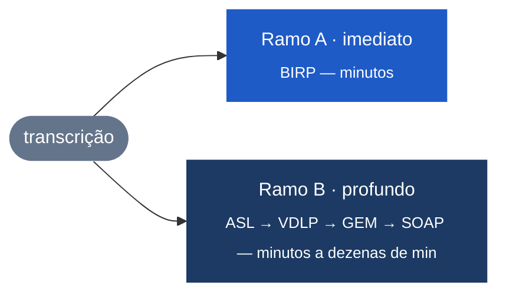

### Stages

| Stage              | Default | Entrada                  | Saída em `$M_BASE/pat/<PID>/`                        |
|--------------------|---------|--------------------------|------------------------------------------------------|
| `transcribe`       | —       | arquivo de áudio         | `audio/transcriptions/*.json` + `.txt`               |
| `birp` *(ramo A)*  | sonnet  | transcrição (só a fala)  | `clinical-documents/<PID>_BIRP_*.md` + `.json` + cria dossiê/`info.json` |
| `normalize`        | sonnet  | transcrição JSON         | cria/atualiza dossiê + `transcriptions/`             |
| `asl`              | opus    | dossiê + data            | `linguistic-analysis/<PID>_<DATE>_ASL.json`          |
| `dimensional`      | opus    | ASL                      | `dimensional-analysis/<PID>_<DATE>_DIMENSIONAL.json` |
| `gem`              | opus    | dimensional              | `gem/<PID>_<DATE>_GEM.json`                          |
| `soap_trajetorial` | sonnet  | transcrição + ASL/VDLP/GEM | `clinical-documents/<PID>_SOAP_TRAJETORIAL_*.md` → **SOAP — Sumário** |
| `soap_longitudinal`| sonnet  | artefatos de várias datas  | `clinical-documents/<PID>_SOAP_LONG_*.md` → **SOAP — Seguimento** |

Identidade do paciente: `PATIENT_ID = PAT_<INICIAIS>_<NN>` (sequencial), em `m_engine/store.py`.
Cada stage é **idempotente** (pula reprocessamento se o artefato existir e `force=False`; análise
profunda invalida o cache por `analysis_version`).

---

## Da fala à estrutura

Cada stage **muda a representação** do mesmo conteúdo — de onda sonora a um documento clínico
ancorado em coordenadas mensuráveis:

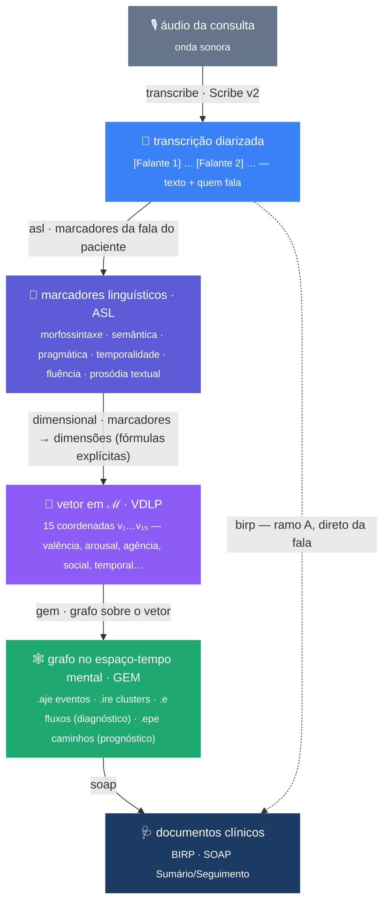

| De → Para | Stage | O que acontece |
|---|---|---|
| áudio → texto | `transcribe` | Diarização por falante (`[Falante N]`), sem timestamps; JSON + `.txt`. |
| texto → nota imediata | `birp` | Lê **só a transcrição**; extrai **B**/**I**/**R**/**P** + metadados clínicos (ICD, medicações, tópicos) e atualiza o `info.json`. |
| texto → dossiê | `normalize` | Identifica paciente/profissional, padroniza terminologia (AHDI), salva o **diálogo completo**. |
| texto → marcadores | `asl` | Análise psicolinguística da fala do paciente em **8 domínios / 11 categorias** — contagens, índices (TTR, conectivos, atos de fala, modalização, disfluências…) **com citações literais**. |
| marcadores → vetor | `dimensional` | Projeta a ASL nas **15 dimensões de ℳ** (`v₁…v₁₅`), cada uma com **fórmula explícita e rastreável** (RDoC/HiTOP/Big Five/PERMA). A sessão vira um **ponto/estado** em ℳ. |
| vetor → grafo | `gem` | Constrói o **grafo** sobre ℳ (abaixo). |
| grafo+transcrição → documento | `soap_*` | Redige a nota clínica ancorada em todas as camadas + na transcrição. |

---

## O manifold ℳ — como e por quê

**ℳ é um espaço vetorial de 15 dimensões** — o "Espaço Mental". Cada dimensão (`v₁…v₁₅`) é uma
**coordenada psicométrica** do estado do paciente (valência, arousal, agência, orientação
temporal, integração social, complexidade cognitiva, coerência narrativa…).

**Por quê.** A linguagem é a janela observável do estado mental. Em vez de uma impressão difusa,
o M-Engine reduz o discurso a um **ponto em ℳ** — e a sessão a uma **trajetória**. Isso torna o
estado **mensurável, comparável** (entre sessões e entre pacientes) e **rastreável**: cada
coordenada vem de uma fórmula sobre marcadores linguísticos concretos, não de um palpite. Os
eixos são ancorados em frameworks validados (RDoC, HiTOP, Big Five, PERMA).

**Como (ASL → VDLP → GEM):**

1. **ASL** extrai os *marcadores* observáveis da fala (quantitativos + exemplos literais).
2. **VDLP** aplica fórmulas marcador → dimensão e produz o **vetor `v₁…v₁₅`**, com
   `valores_asl_extraidos` e `componentes_asl_usados` para auditoria. É o **ponto em ℳ**.
3. **GEM** trata a sessão como um **campo de eventos no espaço-tempo mental** — um grafo de 4 camadas:

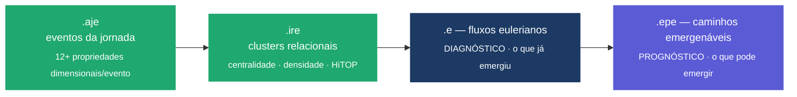

**Atrito vs. alavancagem.** O sofrimento e a potência terapêutica aparecem como **clusters de
atrito** (escalada, perda) versus **clusters de alavancagem** (aliança, esperança, recursos). Os
fluxos `.e` descrevem o que **já** emergiu (diagnóstico); os caminhos `.epe` descrevem o que
**pode** emergir — como canalizar a energia do atrito para a alavancagem (prognóstico e plano).

---

## Documentos clínicos

### A linguagem vira Exame do Estado Mental

Os marcadores da ASL não são números soltos: alimentam **achados objetivos** do EEM na nota SOAP.

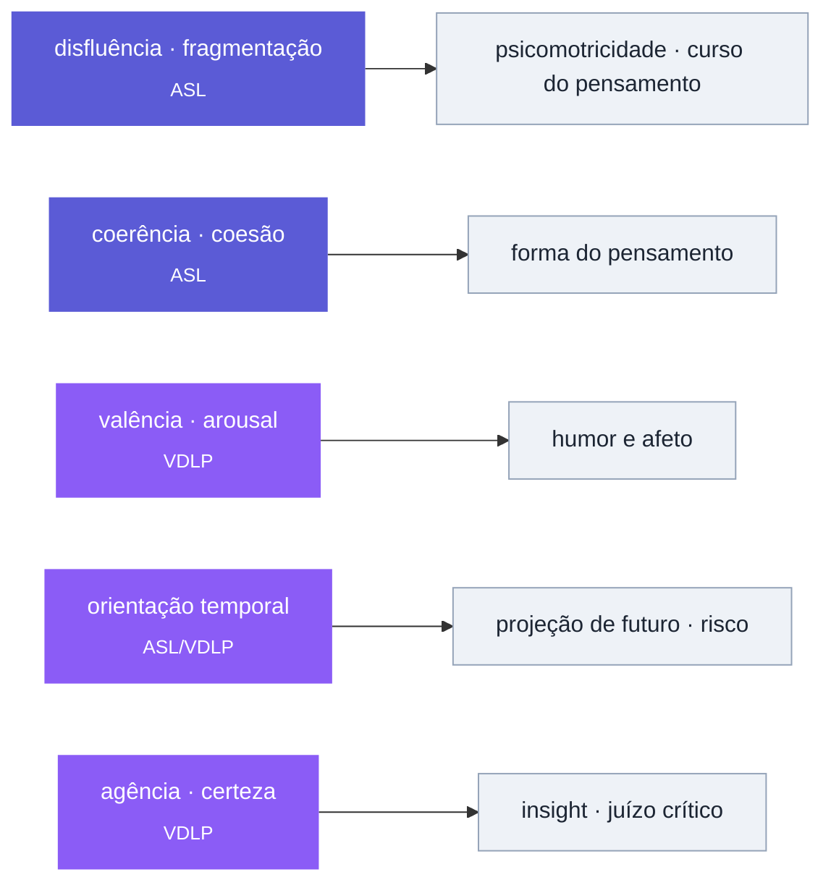

### Anatomia da nota

A nota SOAP é **narrativa-fenomenológica** com CID-10/DSM-5 e EEM construído **a partir da
transcrição**. Duas variantes, mesma filosofia:

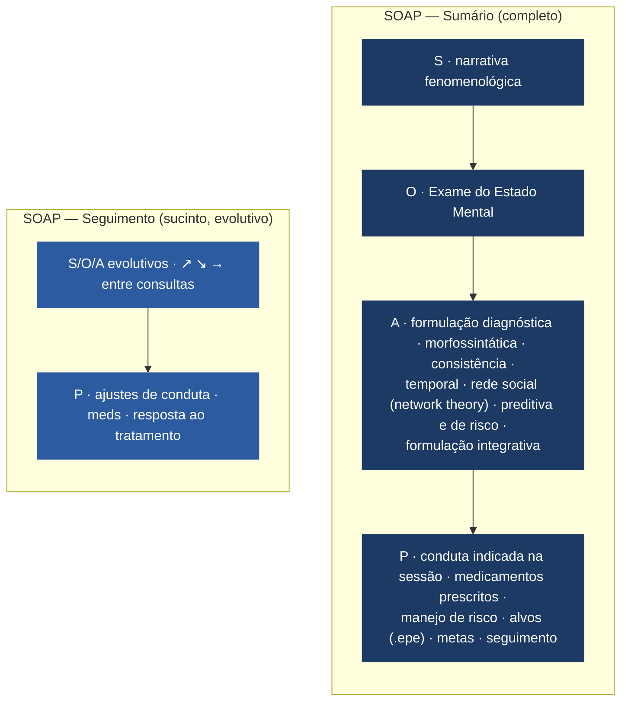

- **Conduta real da consulta.** A seção P extrai da fala do **médico** na transcrição o que ele
  indicou (medicamentos prescritos/suspensos/ajustados com doses, exames, encaminhamentos,
  retorno) e a documenta explicitamente.
- **Evidência, não dashboard.** ASL/VDLP/GEM sustentam os achados (citações + dimensões em prosa
  parcimoniosa). Sem barras, sem "escala 0-5", sem branding — apenas `© 2026 IREAJE` no rodapé.

---

## Assistente clínico (✨ Sonnet 4.6)

Além do pipeline, o app traz um **assistente agêntico** acoplado ao servidor: uma conversa
**geral, única e persistente** — não está presa a um paciente. Ele **lê os dossiês**, **roda os
stages do `m`** e inspeciona arquivos, tudo **confinado a `$M_BASE`**.

```mermaid
%%{init: {'theme':'base','themeVariables':{'fontFamily':'-apple-system,BlinkMacSystemFont,"SF Pro Text","Helvetica Neue",Arial,sans-serif','fontSize':'14px','primaryColor':'#EEF2F7','primaryTextColor':'#1C2533','lineColor':'#64748B'}}}%%
flowchart LR
    APP["📱 App · ✨<br/><sub>FAB (iOS) · inspector (macOS)</sub>"]:::app
    WS{{"WebSocket<br/>/assistant/ws"}}:::edge
    SESS["GeneralAssistant<br/><sub>singleton · 1 turno por vez</sub>"]:::proc
    LLM["Claude Sonnet 4.6<br/><sub>1M · Anthropic API · streaming</sub>"]:::asl
    TOOLS["bash · read_file · write_file<br/><sub>confinados a $M_BASE</sub>"]:::gem
    FS[("$M_BASE/pat<br/><sub>dossiês · CLI m</sub>")]:::phi
    T[("assistant/general.json<br/><sub>transcript persistido</sub>")]:::phi

    APP <-->|"history · ready · assistant · tool · result"| WS
    WS --> SESS
    SESS -->|"messages.stream"| LLM
    LLM -->|"tool_use"| TOOLS
    TOOLS --> FS
    TOOLS -->|"tool_result"| LLM
    SESS -->|"persiste a cada passo"| T
    T -.->|"replay ao reconectar"| APP

    classDef app fill:#1E5BC6,color:#fff,stroke:none
    classDef edge fill:#2C5BA0,color:#fff,stroke:none
    classDef proc fill:#3B82F6,color:#fff,stroke:none
    classDef asl fill:#5B5BD6,color:#fff,stroke:none
    classDef gem fill:#1FA86F,color:#fff,stroke:none
    classDef phi fill:#1C2533,color:#CBD5E1,stroke:#2E5388
```

- **Persistente em segundo plano.** O turno roda **independente do WebSocket**: se o app vai a
  segundo plano e o socket cai, a resposta **continua** no servidor e é salva. Ao reabrir, o
  **histórico é reproduzido** a partir de `$M_BASE/assistant/general.json`.
- **Loop agêntico próprio.** Loop manual de *tool-use* (sem subprocesso): cada `tool_use` do modelo
  é executado server-side (shell/arquivos/`m`), confinado a `$M_BASE`, e o resultado volta ao
  modelo até `end_turn`. Frames compactos chegam ao app: `history · ready · assistant · tool · result · error`.
- **Contexto do profissional.** O perfil em `professional.json` (nome, especialidade, registro) é
  injetado no *system prompt* — o assistente sabe quem está atendendo.
- **No app.** iOS: botão flutuante **✨** abre o chat como *sheet*; macOS: *inspector* lateral.

---

## Arquitetura

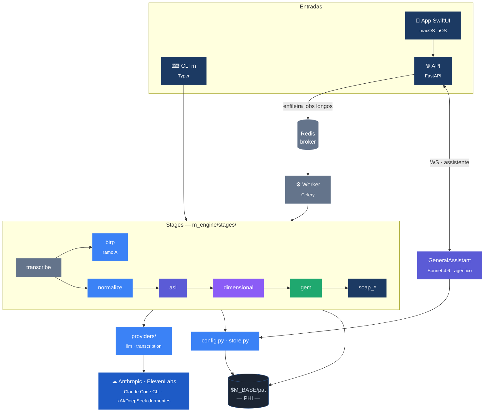

### Dossiê do paciente

```
$M_BASE/
├── audio/
│   └── transcriptions/        ← <base>_transcription.json + .txt
├── assistant/
│   └── general.json           ← transcript persistente do assistente (geral)
├── professional.json          ← perfil do profissional (global ao app)
└── pat/<PID>/
    ├── info.json              ← identidade + sessions[] + clinical_summary
    ├── transcriptions/        ← <DATE>_transcription.json (diálogo completo)
    ├── linguistic-analysis/   ← <PID>_<DATE>_ASL.json
    ├── dimensional-analysis/  ← <PID>_<DATE>_DIMENSIONAL.json
    ├── gem/                   ← <PID>_<DATE>_GEM.json
    └── clinical-documents/    ← <PID>_BIRP_*.md · _SOAP_*.md (+ JSON do BIRP)
```

### Árvore de módulos

```
m_engine/
├── cli.py · api.py · tasks.py     ← superfícies (CLI / API / fila Celery)
├── assistant.py                   ← assistente agêntico persistente (Sonnet 4.6)
├── prewarm.py                     ← pré-aquecimento do prompt cache
├── config.py · store.py · util.py ← config/modelos · dossiê · helpers
├── providers/  (llm · transcription)
├── schemas/    (Pydantic v2)
├── stages/     (um módulo por stage; contratos em __init__)
└── prompts/    (system prompts .md por stage)
```

---

## Prompt caching & pré-aquecimento

Os **system prompts são gigantes e estáveis** (teoria da ASL, framework do GEM) e dominam o custo
de input. O M-Engine os cacheia (TTL **1h** por padrão) e os **pré-aquece** no boot do worker, de
modo que a 1ª chamada real de cada stage já leia a **0.1×**.

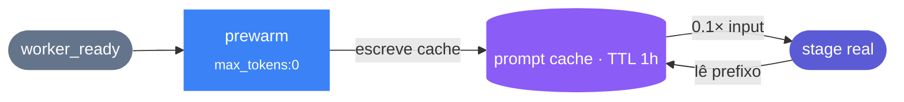

- `M_CACHE_TTL` (`5m` | `1h`, default `1h`); cada chamada loga `cache_hit`/`cache_read`/`cache_write`.
- `m warm` aquece sob demanda; o worker aquece sozinho no boot.
- O ganho aparece em **lote/reprocessamento** dentro do TTL (num paciente avulso, paga-se a escrita uma vez).

---

## Instalação

Requer **Python 3.11+**.

```bash
git clone https://github.com/myselfgus/m.git m-engine && cd m-engine
python3.11 -m venv .venv && source .venv/bin/activate
pip install .          # instala o pacote e o entrypoint `m`
```

## Configuração (`.env`)

```bash
cp .env.example .env   # preencha as chaves — .env não vai ao git
```

| Variável             | Descrição                                                            |
|----------------------|----------------------------------------------------------------------|
| `M_BASE`             | Raiz dos dados (`$M_BASE/pat`, `$M_BASE/audio`, `$M_BASE/assistant`). |
| `ANTHROPIC_API_KEY`  | Provider default do pipeline **e** do assistente (Sonnet 4.6).       |
| `ELEVENLABS_API_KEY` | Transcrição (Scribe v2).                                            |
| `M_DEFAULT_MODEL`    | Aliases ativos: `opus` (default global), `sonnet`, `cc` (Claude Code CLI). |
| `M_FORCE_MODEL`      | Força **todos os stages** num alias (ex.: `cc` = assinatura, sem crédito). Não afeta o assistente, que é sempre Sonnet 4.6 via API. |
| `M_CACHE_TTL`        | TTL do prompt cache: `5m` ou `1h` (default `1h`).                   |
| `M_CLAUDE_CLI_BIN`   | Binário do Claude Code para o alias `cc` (default `claude`).        |
| `REDIS_URL`          | Broker/result-backend do Celery.                                    |
| `M_API_HOST` · `M_API_PORT` | Default `0.0.0.0` · `8000`.                                  |
| `XAI_API_KEY` · `DEEPSEEK_API_KEY` | Opcionais — providers **dormentes** (sem alias ativo).  |

**Defaults por stage** (`config.STAGE_DEFAULTS`): `birp`, `normalize`, `soap_*` → **`sonnet`**;
`asl`, `dimensional`, `gem` → **`opus`** (Claude Opus 4.8: 128K saída / janela 1M, streaming,
adaptive thinking). O alias `cc` roteia o **pipeline** via Claude Code CLI (auth do sistema, sem
API key). O **assistente** ignora `M_FORCE_MODEL` e usa sempre **Claude Sonnet 4.6** via API —
portanto exige `ANTHROPIC_API_KEY` mesmo em deploy `cc`.

---

## Uso — CLI `m`

```bash
m ingest /caminho/sessao.m4a          # ponta a ponta (use --no-deep p/ parar no normalize)
m warm                                # pré-aquece o prompt cache

# passo a passo
m transcribe /caminho/sessao.m4a
m birp       $M_BASE/audio/transcriptions/2026-06-22_transcription.json   # ramo A
m normalize  $M_BASE/audio/transcriptions/2026-06-22_transcription.json   # ramo B
m asl PAT_GDP_01 2026-06-22  &&  m dimensional PAT_GDP_01 2026-06-22  &&  m gem PAT_GDP_01 2026-06-22
m soap      PAT_GDP_01 2026-06-22                  # SOAP — Sumário (uma consulta)
m soap-long PAT_GDP_01 2026-06-01 2026-06-22       # SOAP — Seguimento (várias consultas)

m asl PAT_GDP_01 2026-06-22 --model cc --force     # override de modelo + reprocessa
```

## Uso — API & App

Superfície REST + WebSocket (FastAPI). Polling de jobs longos; CRUD de dossiê; assistente em WS.

| Método | Rota | Função |
|---|---|---|
| `POST` | `/audio` | Upload de áudio (multipart) → grava em `$M_BASE/audio`. |
| `POST` | `/jobs/pipeline` · `/jobs/{stage}` | Pipeline completo de uma sessão, ou um stage isolado. |
| `GET`  | `/jobs/{id}` | Status/resultado (polling). |
| `GET`  | `/stages` | Stages disponíveis (chave + rótulo PT-BR) para a UI. |
| `GET`  | `/patients` | Lista de pacientes (slug · nome · nº de consultas). |
| `GET` · `PUT` | `/patients/{slug}/profile` | Identidade editável do paciente (`profile.json`). |
| `GET`  | `/patients/{slug}/info` | Visão mesclada (profile + index) [compat]. |
| `POST` | `/patients` | Cria dossiê a partir do nome completo. |
| `GET`  | `/patients/{slug}/consultations` | Consultas agrupadas C1/C2/C3… |
| `POST` | `/patients/{slug}/consultations` | Cria uma consulta (data). |
| `GET` · `PUT` | `/patients/{slug}/consultations/{cid}/documents/{nome}` | Lê / salva Markdown de um documento. |
| `POST` | `/patients/{slug}/consultations/{cid}/documents` | Cria um novo documento. |
| `POST` | `/patients/{slug}/consultations/{cid}/files` | Importa um arquivo para a consulta. |
| `GET` · `PUT` | `/professional` | Perfil do profissional (global · `professional.json`). |
| `WS`   | `/assistant/ws` | Assistente agêntico (frames `history · ready · assistant · tool · result · error`). |
| `GET`  | `/assistant/history` | Transcript persistido do assistente (replay alternativo ao WS). |
| `GET`  | `/healthz` | Liveness. |

```bash
curl -F file=@sessao.m4a http://localhost:8000/audio
curl -X POST http://localhost:8000/jobs/pipeline -H 'content-type: application/json' \
  -d '{"audio_path":"/var/lib/m-engine/audio/sessao.m4a","deep":true}'
```

### App SwiftUI (macOS · iOS)

<div align="center">
  
  <br/><sub>o app usa o ícone <code>m-icon</code> — versionado em <code>ui-swift/MEngine/Assets.xcassets/AppIcon</code></sub>
</div>

Cliente multiplataforma em [`ui-swift/`](ui-swift/) no formato **dashboard**, seguindo o
**HealthOS Design System** (macOS 26+ Liquid Glass): uma `NavigationSplitView` com sidebar de
pacientes (buscável) e detalhe em abas — **Início** (stat cards), **Nova sessão**
(gravar/selecionar áudio → enviar → pipeline → polling) e **Paciente** (Consultas C1/C2/C3 ·
Pipeline · Documentos → leitor/editor BIRP/SOAP). O **assistente ✨** é onipresente: *inspector* no
macOS, **FAB** no iPhone. Os **fontes SwiftUI são compartilhados** entre macOS e iOS — pontos
específicos de plataforma ficam sob `#if os(iOS)` / `#if os(macOS)` (ex.: botões de ação **só-ícone**
no iOS para poupar viewport; texto+ícone no macOS).

```bash
cd ui-swift && swift build && swift run        # macOS via SwiftPM (aponta p/ http://localhost:8000)
```

**iOS (device físico).** O projeto Xcode é **gerado pelo `xcodegen`** a partir de
[`ui-swift/project.yml`](ui-swift/project.yml) (fonte de verdade; `*.xcodeproj` e `Info-iOS.plist`
são gerados e ignorados pelo git). O `DEVELOPMENT_TEAM` fica fixado no `project.yml`, então a
assinatura automática sobrevive a cada `xcodegen generate`:

```bash
cd ui-swift && xcodegen generate
xcodebuild -project MEngine-iOS.xcodeproj -scheme MEngine \
  -destination 'id=<UDID do iPhone>' -allowProvisioningUpdates build
```

Em **Ajustes** do app, aponte a URL para a VM (`http://100.x.y.z:8000`, IP Tailscale) e use a aba
**Profissional** para o perfil do clínico. Setup completo (Info.plist, microfone, ATS na tailnet)
em [`ui-swift/README.md`](ui-swift/README.md).

---

## Design System (HealthOS)

O app SwiftUI segue o **HealthOS Design System** (macOS 26+ **Liquid Glass**) — mesma família de
produto do M-Engine. Os tokens canônicos vivem em
[`ui-swift/design/healthos/`](ui-swift/design/healthos/) e são portados para SwiftUI **nativo** em
[`ui-swift/MEngine/HealthOSTheme.swift`](ui-swift/MEngine/HealthOSTheme.swift). Princípio
**system-first**: as famílias resolvem para **SF Pro / SF Pro Rounded / SF Mono** no Apple, então
**nenhuma fonte é embarcada**; a iconografia é **SF Symbols** + o asset **`m-icon`** como marca.

### Paleta da marca

| Token | Hex | Uso |
|---|---|---|
| `ink` |  | texto/wordmark — navy quase-preto |
| `navy` |  | metade escura da marca · avatares |
| `blue` |  | **tint do sistema** · acento primário |
| `blueBright` |  | realce |
| `blueDeep` |  | pressionado/ativo |

### Stage tints — espelham o pipeline (e os diagramas acima)

Cada estágio tem uma cor; usadas nas **capsules** e ícones do app — e **são as mesmas** dos
mermaids deste README.

| Stage | Cor | | Stage | Cor |
|---|---|---|---|---|
| **STT** |  | | **ASL** |  |
| **PROC** |  | | **VDLP** |  |
| **SPEECH** |  | | **GEM** |  |

### Estados semânticos

| Estado | Cor | Estado | Cor |
|---|---|---|---|
| `complete` |  | `error` |  |
| `running` |  | `review` |  |
| `info` |  | `queued` |  |

### Tipografia (escala macOS 26)

| Estilo | Tamanho/peso | SwiftUI |
|---|---|---|
| Large Title | 26 · bold | `.hosLargeTitle` |
| Title 1 · 2 · 3 | 22 · 17 · 15 semibold | `.hosTitle1` · `.hosTitle2` · `.hosTitle3` |
| Headline | 13 · semibold | `.hosHeadline` |
| Body · Callout | 13 · 12 regular | `.hosBody` · `.hosCallout` |
| Subhead · Footnote · Caption | 11/11/10 | `.hosSubhead` · `.hosFootnote` · `.hosCaption` |
| Mono (IDs/transcrição) | 12 · SF Mono | `.hosMono` |
| Stat (números) | rounded | `.hosStat()` |

### Hierarquia de elevação

Nem toda superfície vive no mesmo plano. O design system define **quatro degraus** de elevação —
do recuo (campos) ao flutuante (overlays) — para que profundidade signifique *função*, não enfeite:

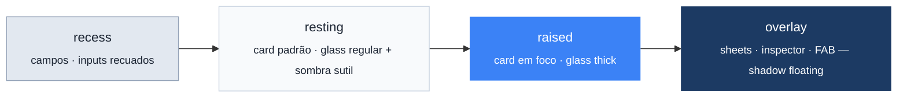

| Degrau | Token / modifier | Material · sombra |
|---|---|---|
| **recess** | `.recessedField()` | superfície recuada para campos de texto |
| **resting** | `.healthCard()` / `.cardShadow()` | `GlassLevel.regular` + sombra de card |
| **raised** | `.glassSurface(.thick)` | `GlassLevel.thick` (blur ↑) para o card em foco |
| **overlay** | `.floatingShadow()` | sombra flutuante — sheets, inspector, FAB |

### Componentes (tokens → SwiftUI)

| Componente | Token/CSS | SwiftUI |
|---|---|---|
| Glass card | `.glass-regular` / `.glass-thick` | `.healthCard()` · `.glassSurface(_:)` |
| Capsule/status | `.capsule[data-state\|stage]` | `StatusPill(text:color:systemImage:)` |
| Stat card | dashboard Home | `StatCard(symbol:value:label:tint:)` |
| Botão de ação | iconografia adaptativa | `ActionLabel(_:systemImage:)` — só-ícone no iOS, texto+ícone no macOS |
| Cores/escala | `:root` vars | `enum HOS` · `extension Font` |
| Marca | connection-node mark | `BrandMark` (usa `m-icon`) |

### Iconografia (SF Symbols)

| Contexto | Símbolo |
|---|---|
| Início · Nova sessão | `house.fill` · `waveform.badge.mic` |
| Paciente · documentos | `person.crop.circle.fill` · `doc.text.fill` |
| BIRP · SOAP · Seguimento | `bolt.heart.fill` · `doc.text.fill` · `chart.line.uptrend.xyaxis` |
| Assistente · enviar | `sparkles` · `arrow.up.circle.fill` |
| CID · medicamentos · tópicos | `cross.case.fill` · `pills.fill` · `tag.fill` |

### Layout do dashboard

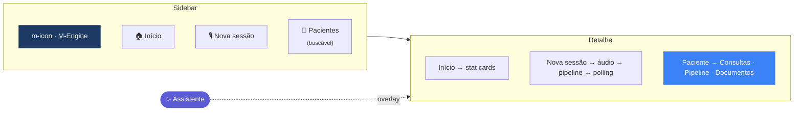

> Detalhes de setup (Xcode, Info.plist, entitlements, ATS) e o mapeamento completo dos tokens em
> [`ui-swift/README.md`](ui-swift/README.md) e [`ui-swift/design/healthos/README.md`](ui-swift/design/healthos/README.md).

---

## Deploy

### systemd no host (produção)

O M-Engine roda **direto no host via systemd — sem Docker**. O motivo: o provider `cc` reaproveita
a **assinatura** do Claude Code (auth do sistema), então o **pipeline** roda sem crédito de API; o
**assistente** usa a API (Sonnet 4.6 · `ANTHROPIC_API_KEY`). Três serviços: `redis-server` (broker),
`m-engine-api` (uvicorn `:8000`) e `m-engine-worker` (Celery, que **pré-aquece o prompt cache** no boot).

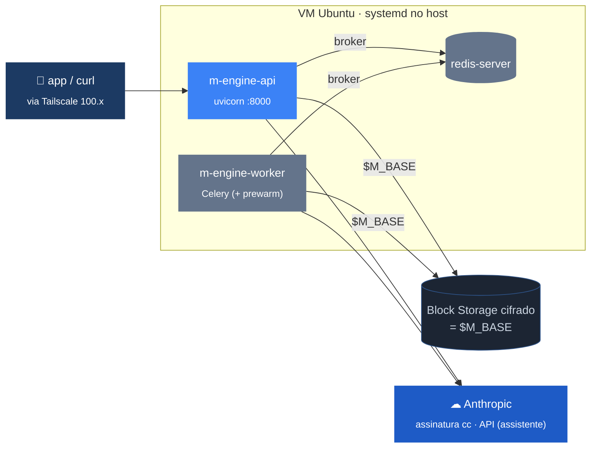

Unidades em `deploy/systemd/` (usuário `ubuntu`/`mengine`, `EnvironmentFile=/etc/m-engine.env`,
`Restart=always`, hardening). Logs e atualização:

```bash
journalctl -u m-engine-api -f                 # logs ao vivo

# atualizar: git pull → reinstala o pacote no venv → reinicia os serviços
cd /opt/m-engine && git pull \
  && /home/ubuntu/m-venv/bin/pip install --force-reinstall --no-deps . \
  && sudo systemctl restart m-engine-worker m-engine-api
```

### Magalu Cloud — VM 24h (runbook)

Passo-a-passo completo em [`deploy/magalu.md`](deploy/magalu.md): **VM** (compute) + **Block Storage**
cifrado pelo provider montado em `$M_BASE` (dossiês + áudio), acesso **privado via Tailscale** (API
liga só no IP da tailnet) e **backup** para o **Object Storage nativo da Magalu**
(`mgc object-storage objects sync` em `deploy/backup.sh` + cron). Runtime padrão = **systemd no host**
(uvicorn + Celery + Redis) com o **pipeline** servido pela assinatura via `cc` (`M_FORCE_MODEL=cc`).
O **assistente** sempre usa a API — mantenha `ANTHROPIC_API_KEY` no `/etc/m-engine.env`. Separa
**m-engine** (compute descartável) de **m-data** (estado no volume).

---

## Segurança & PHI

<div align="center">
  
  <br/><sub>dados sob <code>$M_BASE/pat</code> são PHI — trate como ambiente clínico</sub>
</div>

<br/>

- **Criptografia em repouso** do volume `$M_BASE` (LUKS/dm-crypt ou volume gerenciado); backups cifrados.
- **Segredos só em env / secret manager**; `.env` no `.gitignore`; `M_BASE` definido explicitamente no `EnvironmentFile` (`/etc/m-engine.env`, `0600` root).
- **API não exposta à internet**: privada via Tailscale (IP `100.x`) ou reverse proxy com TLS + auth; Redis sem porta pública.
- **Assistente confinado**: shell/arquivos do agente restritos a `$M_BASE`; nada de PHI fora do volume.
- **Privilégio mínimo**: serviços não-root; systemd com `ProtectSystem=strict`, `NoNewPrivileges`, `UMask=0077`.
- **Retenção e anonimização**: `PATIENT_ID = PAT_<INICIAIS>_<NN>` reduz exposição; limpe `$M_BASE/_debug` periodicamente.

---

<div align="center">
  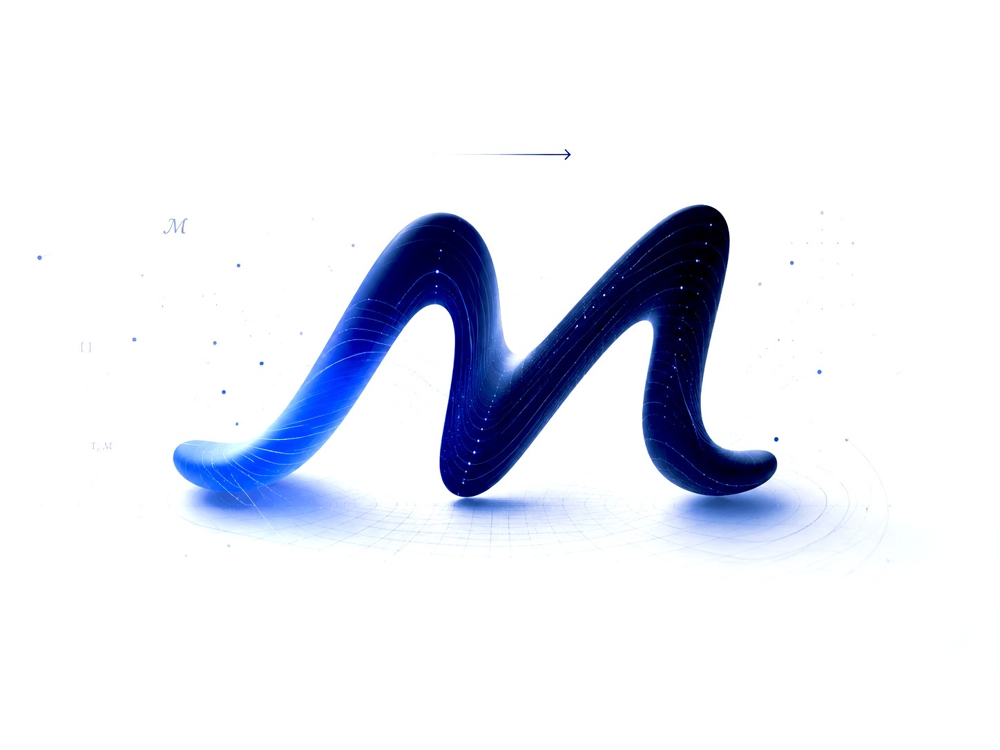
  <br/><br/>
  <sub><em>mental space manifold</em> · © 2026 IREAJE</sub>
</div>
