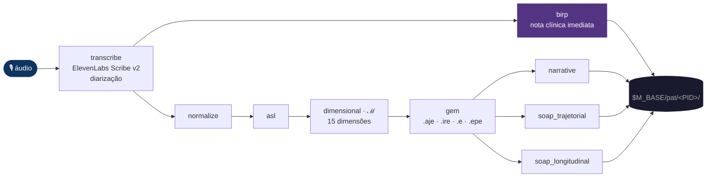
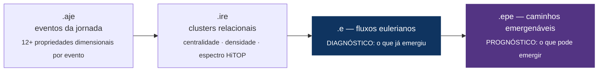
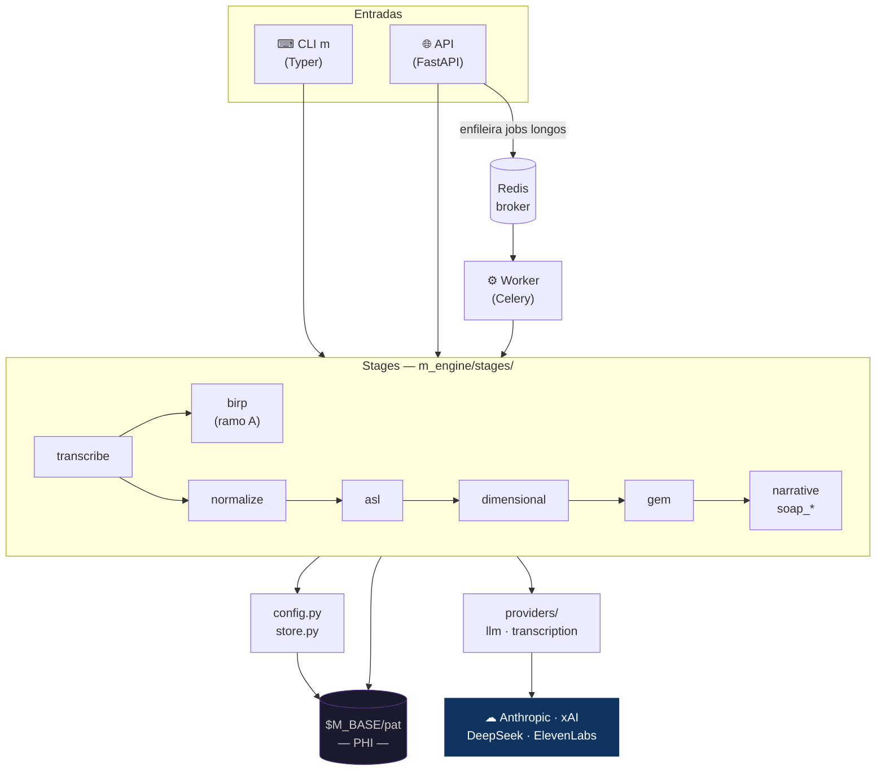
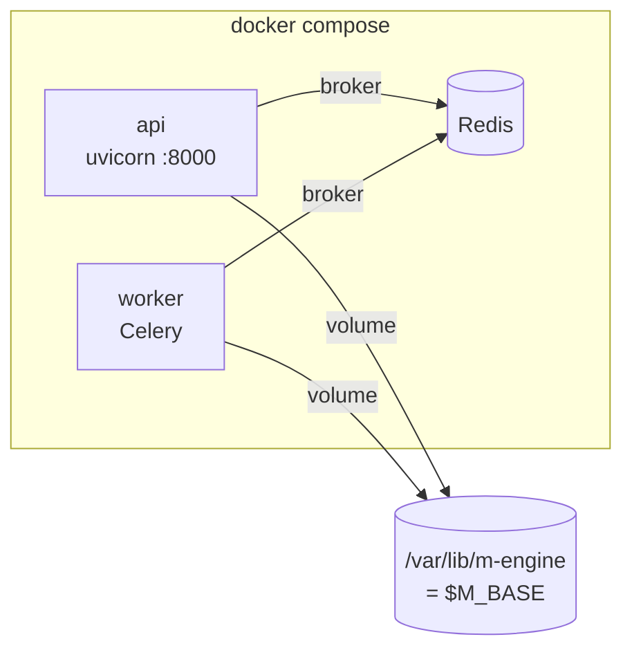

<div align="center">
  
  <h1>M-Engine</h1>
  <p><strong>Pipeline clínico-linguístico · áudio → artefatos estruturados</strong></p>
  <p>
    
    
    
    
    
  </p>
</div>

---

Transforma o áudio de uma sessão clínica em artefatos estruturados. A partir da
**transcrição diarizada**, o fluxo se abre em **dois ramos paralelos**:

- **Ramo A — BIRP** (`transcribe → birp`): nota clínica **imediata** (Behavior · Intervention · Response · Plan) feita só com a transcrição; é também quem cria/atualiza o dossiê e o `info.json`.
- **Ramo B — Espaço Mental ℳ** (`transcribe → normalize → ASL → dimensional → GEM → narrativa → SOAP`): a análise profunda em camadas que projeta a fala no manifold ℳ.

O M-Engine fala **direto** com os providers de modelo (sem gateway intermediário): Anthropic (**Claude Opus 4.8**, default), xAI (Grok) e DeepSeek. A transcrição usa ElevenLabs Scribe com diarização. Os dados de cada paciente (PHI) ficam em `$M_BASE/pat`, em volume dedicado.

---

## Pipeline

<div align="center">
  
  <br/><sub>mental space M — o espaço topológico que o pipeline percorre</sub>
</div>

<br/>

### Fluxo completo



> **Ramo A (BIRP)** é uma folha — não alimenta o ramo B. Os dois partem da mesma transcrição;
> o BIRP roda primeiro só porque estabelece o dossiê/`info.json` que o ramo B reutiliza.

### Stages

| Stage              | Entrada                  | Saída em `$M_BASE/pat/<PID>/`                        |
|--------------------|--------------------------|------------------------------------------------------|
| `transcribe`       | arquivo de áudio         | `audio/transcriptions/*.json` + `.txt`               |
| `birp` *(ramo A)*  | transcrição (só a fala)  | `clinical-documents/<PID>_BIRP_*.md` + `<PID>_<DATE>_BIRP.json` + cria dossiê/`info.json` |
| `normalize`        | transcrição JSON         | cria/atualiza dossiê + `transcriptions/`             |
| `asl`              | dossiê + data            | `linguistic-analysis/<PID>_<DATE>_ASL.json`          |
| `dimensional`      | ASL                      | `dimensional-analysis/<PID>_<DATE>_DIMENSIONAL.json` |
| `gem`              | dimensional              | `gem/<PID>_<DATE>_GEM.json`                          |
| `narrative`        | gem                      | `narrative/`                                         |
| `soap_trajetorial` | artefatos de uma data    | `clinical-documents/<PID>_SOAP_*.md`                 |
| `soap_longitudinal`| artefatos de várias datas| `clinical-documents/<PID>_SOAP_*.md`                 |

Identidade do paciente: `PATIENT_ID = PAT_<INICIAIS>_<NN>` (sequencial) — gerado em `m_engine/store.py`.

Cada stage é **idempotente**: se o artefato já existe e `force=False`, retorna o caminho sem reprocessar.

---

## Da fala à estrutura

Cada stage **muda a representação** do mesmo conteúdo — de onda sonora a um documento clínico
ancorado em coordenadas mensuráveis. O que muda a cada camada:


| De → Para | Stage | O que acontece |
|---|---|---|
| áudio → texto | `transcribe` | Diarização por falante (`[Falante N]`), sem timestamps; gera JSON + `.txt`. |
| texto → nota imediata | `birp` *(ramo A)* | Lê **só a transcrição**; o LLM extrai **B**ehavior/**I**ntervention/**R**esponse/**P**lan + metadados clínicos (ICD, medicações, tópicos) e atualiza o `info.json`. |
| texto → dossiê | `normalize` | Identifica paciente/profissional, padroniza terminologia (AHDI), salva o **diálogo completo** no dossiê. |
| texto → marcadores | `asl` | Análise psicolinguística da fala do paciente em **8 domínios / 11 categorias**: contagens, índices (TTR, conectivos, atos de fala, modalização, distribuição temporal, disfluências…) **com citações literais**. |
| marcadores → vetor | `dimensional` | Projeta a ASL nas **15 dimensões de ℳ** (`v₁…v₁₅`), cada uma com **fórmula explícita e rastreável**, validada por RDoC/HiTOP/Big Five/PERMA. Aqui a sessão vira um **ponto/estado** em ℳ. |
| vetor → grafo | `gem` | Constrói o **grafo** sobre ℳ (ver abaixo). |
| grafo → documento | `soap_*` · `narrative` | Redige a documentação clínica ancorada nas camadas anteriores. |

---

## O manifold ℳ — como e por quê

**ℳ é um espaço vetorial de 15 dimensões** — o "Espaço Mental". Cada dimensão (`v₁…v₁₅`) é uma
**coordenada psicométrica** do estado do paciente (valência, arousal, agência, orientação
temporal, integração social, complexidade cognitiva, coerência narrativa, etc.).

**Por quê um manifold.** A linguagem é a janela observável do estado mental. Em vez de uma
impressão clínica difusa, o M-Engine reduz o discurso a um **ponto em ℳ** — e a sessão inteira a
uma **trajetória**. Isso torna o estado **mensurável, comparável** (entre sessões do mesmo
paciente e entre pacientes) e **rastreável**: cada coordenada vem de uma fórmula sobre marcadores
linguísticos concretos da ASL, não de um palpite. Os eixos são ancorados em frameworks validados
(RDoC, HiTOP, Big Five, PERMA), então a posição em ℳ tem leitura clínica.

**Como é construído (ASL → VDLP → GEM):**

1. **ASL** extrai os *marcadores* observáveis da fala (quantitativos + exemplos literais).
2. **VDLP** (`dimensional`) aplica fórmulas explícitas marcador → dimensão, produzindo o **vetor `v₁…v₁₅`** com `valores_asl_extraidos` e `componentes_asl_usados` para auditoria. É o **ponto em ℳ**.
3. **GEM** trata a sessão não como um ponto isolado, mas como um **campo de eventos no espaço-tempo mental** — um grafo de 4 camadas sobre ℳ:



**Por que grafo euleriano + emergenabilidade.** O sofrimento e a potência terapêutica aparecem
como **clusters de atrito** (ex.: escalada/perda) versus **clusters de alavancagem** (ex.: aliança,
esperança, recursos). Os **fluxos eulerianos `.e`** descrevem as trajetórias que **já** emergiram
(diagnóstico); os **caminhos emergenáveis `.epe`** descrevem o que **pode** emergir — como canalizar
a energia do atrito para a alavancagem (prognóstico e plano). É isso que dá ao SOAP um **substrato
dimensional** em vez de só impressão narrativa.

---

## Arquitetura

### Componentes e execução



### Árvore de módulos

```
m_engine/
├── cli.py              ← entrypoint CLI (Typer)
├── api.py              ← FastAPI app
├── tasks.py            ← jobs Celery
├── config.py           ← ponto único de config / model registry
├── store.py            ← naming de artefatos + identity do paciente
├── util.py             ← helpers (extract_json, retry, …)
├── providers/
│   ├── llm.py          ← chamadas diretas Anthropic / xAI / DeepSeek
│   └── transcription.py← ElevenLabs Scribe
├── schemas/            ← Pydantic v2 (ASL, dimensional, GEM, …)
├── stages/             ← um módulo por stage (contratos em __init__)
└── prompts/            ← system prompts .md por stage
```

---

## Instalação

Requer **Python 3.11+**.

```bash
git clone https://github.com/myselfgus/m.git m-engine && cd m-engine

python3.11 -m venv .venv
source .venv/bin/activate

pip install .          # instala o pacote e o entrypoint `m`
pip install pytest     # para testes
```

---

## Configuração (`.env`)

```bash
cp .env.example .env   # preencha as chaves — .env não vai ao git
```

| Variável             | Descrição                                                            |
|----------------------|----------------------------------------------------------------------|
| `M_BASE`             | Raiz dos dados (`$M_BASE/pat`, `$M_BASE/audio`).                    |
| `ANTHROPIC_API_KEY`  | Provider default.                                                    |
| `XAI_API_KEY`        | Opcional — só em seleção explícita.                                 |
| `DEEPSEEK_API_KEY`   | Opcional — só em seleção explícita.                                 |
| `ELEVENLABS_API_KEY` | Transcrição (Scribe).                                               |
| `REDIS_URL`          | Broker/result-backend do Celery.                                    |
| `M_API_HOST`         | Default `0.0.0.0`.                                                  |
| `M_API_PORT`         | Default `8000`.                                                     |
| `M_DEFAULT_MODEL`    | Aliases ativos: `opus` (default global), `sonnet`, `cc` (Claude Code via CLI). |

**Defaults por stage** (`config.STAGE_DEFAULTS`): `birp`, `normalize` e os `soap_*` usam **`sonnet`**;
`asl`, `dimensional` e `gem` usam **`opus`** (Claude Opus 4.8, 128K saída / janela 1M, streaming).
O alias `cc` roteia via **Claude Code CLI** (reaproveita a auth do sistema, sem API key). xAI/DeepSeek
têm o plumbing presente mas estão **dormentes** (sem alias ativo no momento).

---

## Uso — CLI `m`

```bash
# 0. Ponta a ponta (recomendado): áudio → transcribe → birp + normalize→asl→dim→gem→soap_t
m ingest /caminho/sessao.m4a              # use --no-deep para parar no normalize

# --- ou rodando passo a passo ---

# 1. Transcrever (ElevenLabs Scribe v2, com diarização)
m transcribe /caminho/sessao.m4a

# 2a. BIRP — nota clínica imediata (ramo A); cria dossiê + info.json
m birp $M_BASE/audio/transcriptions/2026-06-22_transcription.json

# 2b. Normalizar (ramo B) → cria/atualiza dossiê
m normalize $M_BASE/audio/transcriptions/2026-06-22_transcription.json

# 3. Stages profundos (ramo B)
m asl          PAT_JS_01 2026-06-22
m dimensional  PAT_JS_01 2026-06-22
m gem          PAT_JS_01 2026-06-22
m narrative    PAT_JS_01 2026-06-22

# 4. SOAP
m soap      PAT_JS_01 2026-06-22                   # trajetorial (uma data)
m soap-long PAT_JS_01 2026-06-01 2026-06-22        # longitudinal (várias datas)

# Override de modelo + reprocessamento forçado
m asl PAT_JS_01 2026-06-22 --model cc --force      # ex.: rodar via Claude Code CLI
```

---

## Uso — API & App

A **API FastAPI** orquestra os jobs (enfileira no Celery) e serve os artefatos:

| Método | Rota | Função |
|---|---|---|
| `POST` | `/audio` | Upload de áudio (multipart) → grava em `$M_BASE/audio`. |
| `POST` | `/jobs/pipeline` | Dispara o pipeline completo de uma sessão num **único job**. |
| `POST` | `/jobs/{stage}` | Enfileira um stage isolado. |
| `GET`  | `/jobs/{id}` | Status/resultado do job (polling). |
| `GET`  | `/patients` · `/patients/{id}/documents` · `/.../documents/{nome}` · `/.../info` | Navegar dossiês e ler BIRP/SOAP (Markdown). |
| `GET`  | `/healthz` | Liveness. |

```bash
# upload + pipeline completo, depois acompanha o job
curl -F file=@sessao.m4a http://localhost:8000/audio
curl -X POST http://localhost:8000/jobs/pipeline \
  -H 'content-type: application/json' \
  -d '{"audio_path":"/var/lib/m-engine/audio/sessao.m4a","deep":true}'
```

### App SwiftUI (macOS · iOS)

Cliente multiplataforma em [`ui-swift/`](ui-swift/): **gravar/selecionar áudio → enviar → disparar o
pipeline → acompanhar o job → ler BIRP/SOAP** renderizados. No macOS dá para rodar direto via SwiftPM:

```bash
cd ui-swift && swift build && swift run        # janela do app (aponta p/ http://localhost:8000)
```

Para iOS e distribuição assinada, monte o projeto Xcode multiplataforma — passo-a-passo,
Info.plist (microfone), entitlements e ATS em [`ui-swift/README.md`](ui-swift/README.md).

---

## Deploy

### Docker Compose

```bash
cp .env.example .env
export M_BASE=/srv/m-engine/data   # volume PHI (cifrado)

docker compose -f deploy/docker-compose.yml up -d --build
```

Sobe `redis`, `api` (uvicorn `:8000`) e `worker` (Celery). API e worker compartilham o volume `$M_BASE` em `/var/lib/m-engine`.



### systemd (VM de produção)

Unidades em `deploy/systemd/`. Usuário dedicado `mengine`, `EnvironmentFile=/etc/m-engine.env`, `Restart=always`.

```bash
sudo useradd --system --home /opt/m-engine --shell /usr/sbin/nologin mengine
sudo mkdir -p /opt/m-engine && sudo chown mengine:mengine /opt/m-engine

sudo -u mengine python3.11 -m venv /opt/m-engine/venv
sudo -u mengine /opt/m-engine/venv/bin/pip install /caminho/do/projeto

sudo install -m 0600 -o mengine -g mengine .env /etc/m-engine.env

sudo cp deploy/systemd/m-engine-{api,worker}.service /etc/systemd/system/
sudo systemctl daemon-reload
sudo systemctl enable --now m-engine-api m-engine-worker
```

Logs: `journalctl -u m-engine-api -f` · `journalctl -u m-engine-worker -f`

---

## Segurança & PHI

<div align="center">
  
  <br/><sub>dados sob <code>$M_BASE/pat</code> são PHI — trate como ambiente clínico</sub>
</div>

<br/>

- **Criptografia em repouso.** Volume `$M_BASE` cifrado no disco (LUKS/dm-crypt ou volume gerenciado com *encryption at rest*). Backups também cifrados.
- **Segredos só em env / secret manager.** Chaves nunca no código ou na imagem. `.env` está no `.gitignore`. Em produção, prefira um secret manager injetando o `EnvironmentFile` em runtime.
- **API não exposta à internet.** Reverse proxy com TLS + autenticação; restringir `:8000` à rede interna. Redis sem porta pública.
- **Privilégio mínimo.** Containers e serviços rodam como `mengine` (não-root). Systemd com `ProtectSystem=strict`, `NoNewPrivileges`, `PrivateTmp`, `UMask=0077`.
- **Retenção e anonimização.** Defina política de retenção dos dossiês. `PATIENT_ID = PAT_<INICIAIS>_<NN>` reduz exposição do nome; para uso secundário exporte apenas dados anonimizados.
- **Logs de debug.** `extract_json` pode gravar payloads malformados em `$M_BASE/_debug` — limpar periodicamente, pois pode conter conteúdo clínico.

---

<div align="center">
  
  <br/><br/>
  <sub><em>mental space manifold</em> · M-Engine © 2026</sub>
</div>
