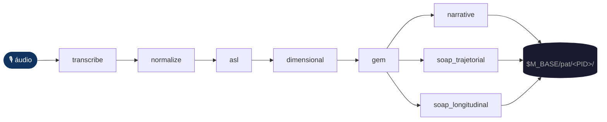
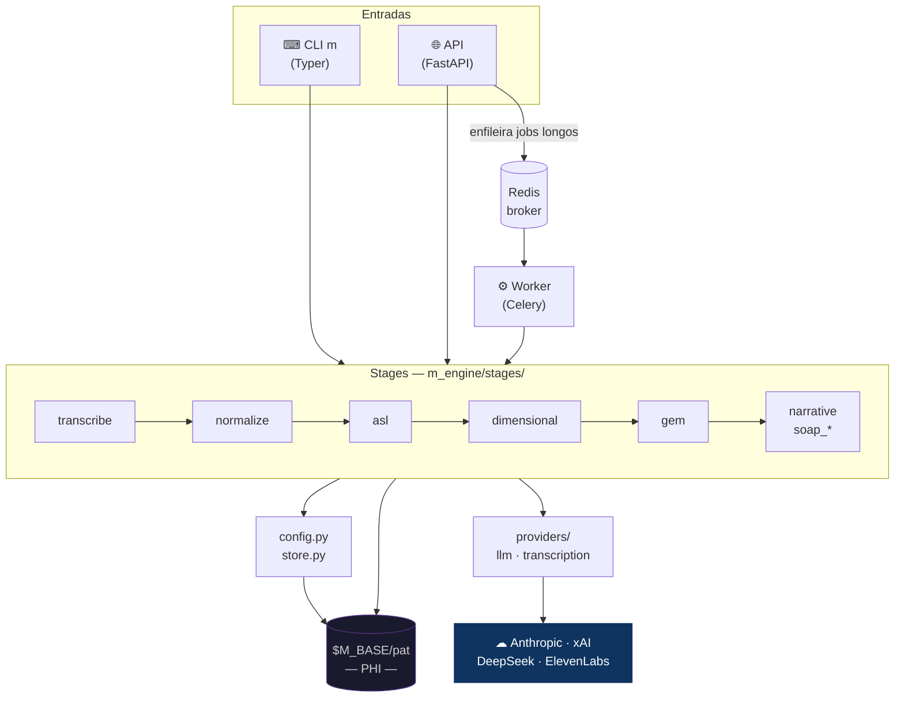
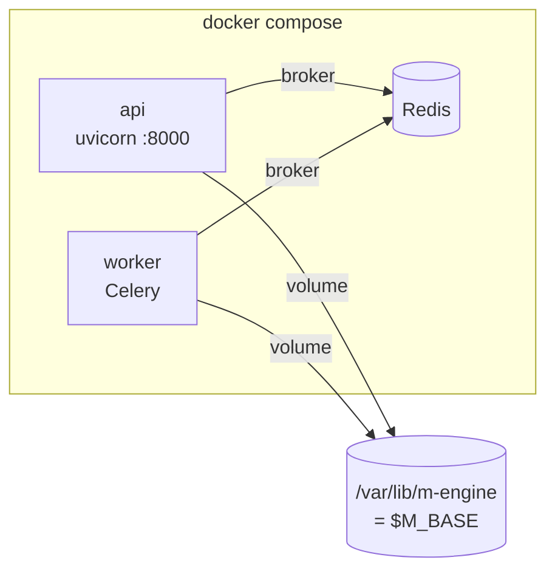

<div align="center">
  
  <h1>M-Engine</h1>
  <p><strong>Pipeline clínico-linguístico · áudio → artefatos estruturados</strong></p>
  <p>
    
    
    
    
    
  </p>
</div>

---

Transforma o áudio de uma sessão clínica em artefatos estruturados através de um pipeline linguístico em camadas:

**transcrição → normalização → ASL → dimensional → GEM → narrativa → SOAP**

O M-Engine fala **direto** com os providers de modelo (sem gateway intermediário): Anthropic (**Claude Opus 4.8**, default), xAI (Grok) e DeepSeek. A transcrição usa ElevenLabs Scribe com diarização. Os dados de cada paciente (PHI) ficam em `$M_BASE/pat`, em volume dedicado.

---

## Pipeline

<div align="center">
  
  <br/><sub>mental space M — o espaço topológico que o pipeline percorre</sub>
</div>

<br/>

### Fluxo completo



### Stages

| Stage              | Entrada                  | Saída em `$M_BASE/pat/<PID>/`                        |
|--------------------|--------------------------|------------------------------------------------------|
| `transcribe`       | arquivo de áudio         | `audio/transcriptions/*.json`                        |
| `normalize`        | transcrição JSON         | cria/atualiza dossiê + `transcriptions/`             |
| `asl`              | dossiê + data            | `linguistic-analysis/<PID>_<DATE>_ASL.json`          |
| `dimensional`      | ASL                      | `dimensional-analysis/<PID>_<DATE>_DIMENSIONAL.json` |
| `gem`              | dimensional              | `gem/<PID>_<DATE>_GEM.json`                          |
| `narrative`        | gem                      | `narrative/`                                         |
| `soap_trajetorial` | artefatos de uma data    | `clinical-documents/<PID>_SOAP_*.md`                 |
| `soap_longitudinal`| artefatos de várias datas| `clinical-documents/<PID>_SOAP_*.md`                 |

Identidade do paciente: `PATIENT_ID = PAT_<INICIAIS>_<NN>` (sequencial) — gerado em `m_engine/store.py`.

Cada stage é **idempotente**: se o artefato já existe e `force=False`, retorna o caminho sem reprocessar.

---

## Arquitetura

### Componentes e execução



### Árvore de módulos

```
m_engine/
├── cli.py              ← entrypoint CLI (Typer)
├── api.py              ← FastAPI app
├── tasks.py            ← jobs Celery
├── config.py           ← ponto único de config / model registry
├── store.py            ← naming de artefatos + identity do paciente
├── util.py             ← helpers (extract_json, retry, …)
├── providers/
│   ├── llm.py          ← chamadas diretas Anthropic / xAI / DeepSeek
│   └── transcription.py← ElevenLabs Scribe
├── schemas/            ← Pydantic v2 (ASL, dimensional, GEM, …)
├── stages/             ← um módulo por stage (contratos em __init__)
└── prompts/            ← system prompts .md por stage
```

---

## Instalação

Requer **Python 3.11+**.

```bash
git clone https://github.com/myselfgus/m.git m-engine && cd m-engine

python3.11 -m venv .venv
source .venv/bin/activate

pip install .          # instala o pacote e o entrypoint `m`
pip install pytest     # para testes
```

---

## Configuração (`.env`)

```bash
cp .env.example .env   # preencha as chaves — .env não vai ao git
```

| Variável             | Descrição                                                            |
|----------------------|----------------------------------------------------------------------|
| `M_BASE`             | Raiz dos dados (`$M_BASE/pat`, `$M_BASE/audio`).                    |
| `ANTHROPIC_API_KEY`  | Provider default.                                                    |
| `XAI_API_KEY`        | Opcional — só em seleção explícita.                                 |
| `DEEPSEEK_API_KEY`   | Opcional — só em seleção explícita.                                 |
| `ELEVENLABS_API_KEY` | Transcrição (Scribe).                                               |
| `REDIS_URL`          | Broker/result-backend do Celery.                                    |
| `M_API_HOST`         | Default `0.0.0.0`.                                                  |
| `M_API_PORT`         | Default `8000`.                                                     |
| `M_DEFAULT_MODEL`    | Aliases: `opus` (default), `sonnet`, `haiku`, `grok`, `deepseek`.  |

O default de todos os stages é **`opus`** (Claude Opus 4.8). xAI e DeepSeek nunca são default — só entram via `--model`.

---

## Uso — CLI `m`

```bash
# 1. Transcrever (ElevenLabs, com diarização)
m transcribe /caminho/sessao.m4a

# 2. Normalizar → cria/atualiza dossiê
m normalize $M_BASE/audio/transcriptions/2026-06-22_transcription.json

# 3. Stages individuais
m asl          PAT_JS_01 2026-06-22
m dimensional  PAT_JS_01 2026-06-22
m gem          PAT_JS_01 2026-06-22
m narrative    PAT_JS_01 2026-06-22

# 4. SOAP
m soap PAT_JS_01 2026-06-22                        # trajetorial (uma data)
m soap PAT_JS_01 2026-06-01 2026-06-22 --long      # longitudinal (várias datas)

# Override de modelo + reprocessamento forçado
m asl PAT_JS_01 2026-06-22 --model grok --force
```

---

## Deploy

### Docker Compose

```bash
cp .env.example .env
export M_BASE=/srv/m-engine/data   # volume PHI (cifrado)

docker compose -f deploy/docker-compose.yml up -d --build
```

Sobe `redis`, `api` (uvicorn `:8000`) e `worker` (Celery). API e worker compartilham o volume `$M_BASE` em `/var/lib/m-engine`.



### systemd (VM de produção)

Unidades em `deploy/systemd/`. Usuário dedicado `mengine`, `EnvironmentFile=/etc/m-engine.env`, `Restart=always`.

```bash
sudo useradd --system --home /opt/m-engine --shell /usr/sbin/nologin mengine
sudo mkdir -p /opt/m-engine && sudo chown mengine:mengine /opt/m-engine

sudo -u mengine python3.11 -m venv /opt/m-engine/venv
sudo -u mengine /opt/m-engine/venv/bin/pip install /caminho/do/projeto

sudo install -m 0600 -o mengine -g mengine .env /etc/m-engine.env

sudo cp deploy/systemd/m-engine-{api,worker}.service /etc/systemd/system/
sudo systemctl daemon-reload
sudo systemctl enable --now m-engine-api m-engine-worker
```

Logs: `journalctl -u m-engine-api -f` · `journalctl -u m-engine-worker -f`

---

## Segurança & PHI

<div align="center">
  
  <br/><sub>dados sob <code>$M_BASE/pat</code> são PHI — trate como ambiente clínico</sub>
</div>

<br/>

- **Criptografia em repouso.** Volume `$M_BASE` cifrado no disco (LUKS/dm-crypt ou volume gerenciado com *encryption at rest*). Backups também cifrados.
- **Segredos só em env / secret manager.** Chaves nunca no código ou na imagem. `.env` está no `.gitignore`. Em produção, prefira um secret manager injetando o `EnvironmentFile` em runtime.
- **API não exposta à internet.** Reverse proxy com TLS + autenticação; restringir `:8000` à rede interna. Redis sem porta pública.
- **Privilégio mínimo.** Containers e serviços rodam como `mengine` (não-root). Systemd com `ProtectSystem=strict`, `NoNewPrivileges`, `PrivateTmp`, `UMask=0077`.
- **Retenção e anonimização.** Defina política de retenção dos dossiês. `PATIENT_ID = PAT_<INICIAIS>_<NN>` reduz exposição do nome; para uso secundário exporte apenas dados anonimizados.
- **Logs de debug.** `extract_json` pode gravar payloads malformados em `$M_BASE/_debug` — limpar periodicamente, pois pode conter conteúdo clínico.

---

<div align="center">
  
  <br/><br/>
  <sub><em>mental space manifold</em> · M-Engine © 2026</sub>
</div>
