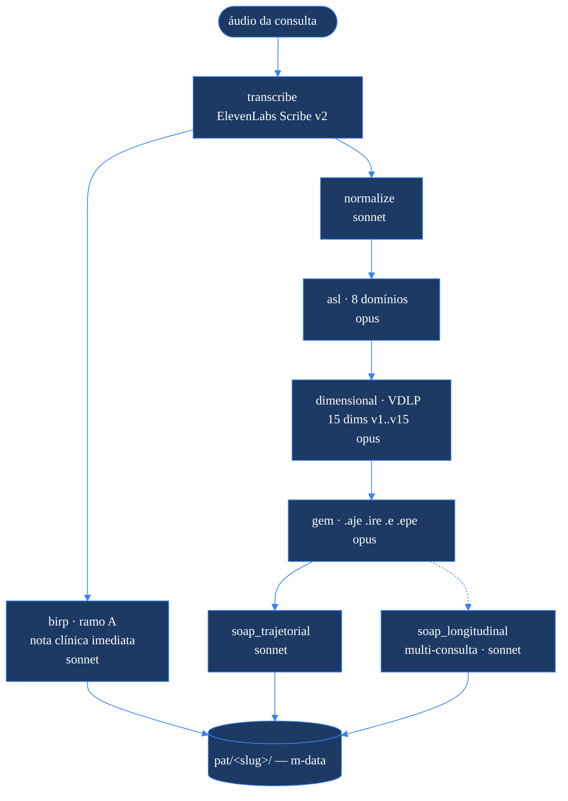
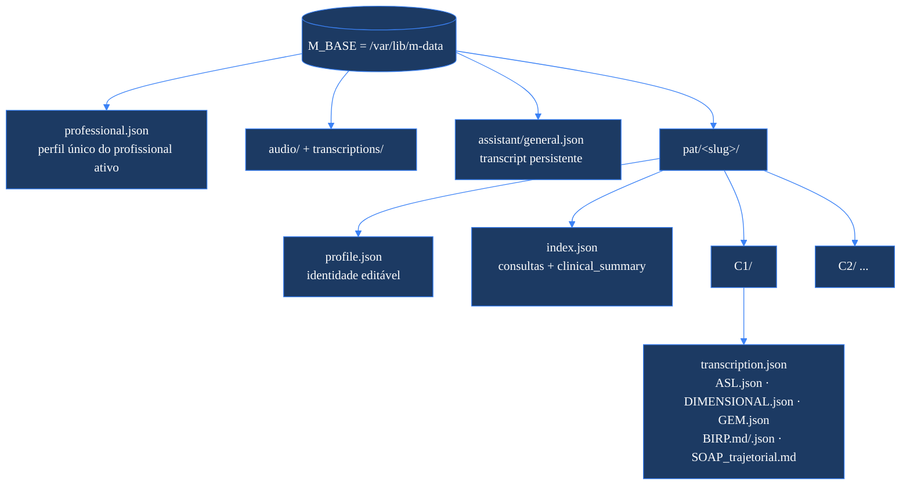

# m-engine — backend clínico-linguístico

`m-engine` é o **backend** do produto: um serviço **clínico-linguístico** (FastAPI + Celery)
que transforma o **áudio de uma consulta** num **dossiê multidimensional** — da transcrição
diarizada às notas clínicas (BIRP, SOAP), passando pela análise linguística (ASL), pelo perfil
dimensional (VDLP) e pelo grafo do espaço mental (GEM).

Tudo o que o serviço gera vive em **m-data**, a raiz de dados configurada em `M_BASE`
(default `/var/lib/m-data`). O cliente (**mapp**, app SwiftUI em `ui-swift/`) consome **somente
a API** descrita aqui — não há lógica clínica no cliente.

> Este README documenta o **pacote `m_engine/`** (API, pipeline, store, providers, assistente).
> A visão geral do produto, design system e detalhes de uso/CLI estão no
> [README raiz](../README.md). Contratos e fronteiras ficam em
> [`../ARCHITECTURE.md`](../ARCHITECTURE.md) e [`../docs/API.md`](../docs/API.md).

---

## Módulos

| Módulo | Papel |
|---|---|
| `api.py` | **Orquestração.** FastAPI: enfileira jobs no Celery, consulta status, CRUD de dossiês/consultas/documentos, perfil do profissional e WebSocket do assistente. **Só roteia — sem lógica de negócio.** |
| `tasks.py` | **Fila (Celery).** Uma task fina por stage; imports **lazy** do stage dentro da task. Broker/backend = `REDIS_URL`. O `pipeline` roda a topologia completa de uma sessão num único job. |
| `stages/` | **A computação.** Um módulo por stage (`transcribe`, `normalize`, `birp`, `asl`, `dimensional`, `gem`, `soap_trajetorial`, `soap_longitudinal`). Cada stage é idempotente (`force=False` pula reprocessamento) e toda chamada a LLM passa por `providers/llm.py`. |
| `store.py` | **Modelo de dados em arquivos.** `slug` legível e estável por paciente; `profile.json` (identidade editável) + `index.json` (consultas + `clinical_summary`); uma pasta `C{n}/` por consulta. **Naming de artefatos centralizado aqui** (assinaturas `(patient_id, date)` preservadas; o store resolve a pasta `C{n}` pela data). |
| `providers/llm.py` | **Bloco único de chamadas a LLM.** Providers **diretos** (sem gateway): `anthropic`, `claude_cli`/alias `cc` (auth do sistema via Claude Code CLI), `xai`/`deepseek` (dormentes). Política de **retry** (429/5xx/timeout, backoff exponencial, 3 tentativas), prompt caching, continuação automática em truncamento e **ZERO degradação silenciosa** (JSON inválido → debug-dump + erro; nunca conserta conteúdo no escuro). |
| `assistant.py` | **Assistente agêntico** (Claude Sonnet 4.6 via Anthropic API), conversa **geral e persistente** com transcript em `M_BASE/assistant/general.json`, loop de tool-use confinado a `M_BASE`. **Área separada** do pipeline — não faz parte da topologia de stages. |
| `config.py` | Ponto único de verdade: chaves, paths derivados de `M_BASE`, registro de modelos e defaults por stage. |

---

## Pipeline

A partir do áudio, o fluxo se abre em **dois ramos** que partilham a mesma transcrição:
o **ramo A** (BIRP) entrega uma nota clínica imediata; o **ramo B** faz a análise profunda
`normalize → ASL → dimensional (VDLP) → gem → soap`.



**Defaults de modelo por stage** (`config.STAGE_DEFAULTS`): o default global é **Claude Opus 4.8**
(`opus`); `birp`, `normalize` e os SOAPs (`soap_trajetorial`/`soap_longitudinal`) usam **`sonnet`**
(Claude Sonnet 4.6); `asl`, `dimensional` e `gem` usam **`opus`**. Um override explícito de `model`
vence o default; `M_FORCE_MODEL` (ex.: `cc`) força um único modelo em **todos** os stages — útil em
deploy que roda o pipeline pela assinatura do Claude Code, sem crédito de API.

| Stage | Default | Entrada | Saída em `pat/<slug>/C{n}/` |
|---|---|---|---|
| `transcribe` | — | arquivo de áudio | `audio/transcriptions/<base>_transcription.json` + `.txt` |
| `birp` *(ramo A)* | `sonnet` | transcrição bruta | `BIRP.md` + `BIRP.json` (+ cria/atualiza o dossiê e o `index.json`) |
| `normalize` | `sonnet` | transcrição bruta | `transcription.json` (diálogo completo normalizado) |
| `asl` | `opus` | transcrição da consulta | `ASL.json` |
| `dimensional` | `opus` | `ASL.json` (+ fala filtrada) | `DIMENSIONAL.json` |
| `gem` | `opus` | transcrição + ASL + VDLP | `GEM.json` |
| `soap_trajetorial` | `sonnet` | transcrição + ASL/VDLP/GEM | `SOAP_trajetorial.md` |
| `soap_longitudinal` | `sonnet` | artefatos de várias datas | `longitudinal/SOAP_longitudinal_*.md` |

---

## Modelo de dados

O `store.py` é orientado a **NOME + consultas**. Cada paciente é uma pasta `pat/<slug>/`, com a
**identidade** separada do **estado clínico**:

- **`profile.json` — identidade editável.** Nome de exibição/completo, CPF, telefone, idade, e-mail,
  notas. O `slug` é derivado do nome na criação e é **estável**: corrigir o nome no profile **não**
  muda o slug nem quebra caminhos.
- **`index.json` — mantido pela máquina.** Lista de consultas (`C1`, `C2`, …, com data e metadados) e o
  `clinical_summary` agregado (CID, medicações, tópicos e tipos de encontro acumulados por sessão).



O **naming dos artefatos é unificado** e centralizado em `store.py` (`asl_path`, `dimensional_path`,
`gem_path`, `birp_doc_path`/`birp_json_path`, `soap_trajetorial_path`, `longitudinal_dir`). As funções
mantêm a assinatura `(patient_id, date)` — `patient_id` é o slug e o store resolve a pasta `C{n}` pela
data via `index.json`, mantendo os stages praticamente inalterados.

---

## `professional.json`

Em `M_BASE/professional.json` vive o **perfil único do profissional ativo** (o clínico que usa o
sistema), global ao app — não confundir com o objeto `professional` opcional dentro de cada
`profile.json`. Ele exerce três papéis:

1. **Assinatura de documentos** — `store.professional_signature_block()` monta o bloco de assinatura
   (nome, credencial CRM/RQE, especialidade, clínica) anexado ao fim do BIRP e do SOAP.
2. **Identificação nas consultas** — é o `professional` registrado no dossiê em `register_session`,
   fonte de verdade preferida sobre o nome que o LLM eventualmente detecta na transcrição.
3. **Aterramento (grounding) da normalização** — o perfil é injetado nos prompts de `normalize` para
   que o modelo atribua corretamente a fala do clínico e não alucine as palavras do médico.

Campos: `name`, `specialty`, `credential` (CRM/RQE; aceita o alias legado `registration`), `clinic`,
`signature`, `notes`. Lido/escrito por `GET`/`PUT /professional`. *(Este amarramento está sendo
consolidado: o objetivo é que `professional.json` seja a referência canônica do profissional em todos
os stages e na assinatura.)*

---

## Deploy

O `m-engine` roda **direto no host via systemd** (sem Docker), em `/opt/m-engine`, com dois serviços:

- **`m-engine-api`** — `uvicorn` ligado no **IP da tailnet** (Tailscale, `100.x`), porta `8000`;
- **`m-engine-worker`** — Celery (consome a fila Redis; pré-aquece o prompt cache no boot).

Atualização típica: `git pull` → `pip install` (reinstala o pacote no venv) → `systemctl restart`
dos serviços. A **transcrição** usa **ElevenLabs Scribe v2** (`scribe_v2`, diarizado, sem timestamps);
exige `ELEVENLABS_API_KEY`. Os dados (PHI) ficam em `M_BASE` num volume dedicado e cifrado.

```bash
journalctl -u m-engine-api -f
cd /opt/m-engine && git pull && <venv>/bin/pip install . \
  && sudo systemctl restart m-engine-worker m-engine-api
```

---

## Fronteira com o cliente (mapp)

A **API REST + WebSocket** é a **costura** entre o `m-engine` e o cliente **mapp**: o app envia áudio,
dispara o pipeline, faz polling de jobs, lê/edita documentos do dossiê e conversa com o assistente —
sempre pela API, nunca tocando o store diretamente. Os contratos completos (endpoints, payloads,
frames do WebSocket) e as fronteiras entre os componentes estão em
[`../docs/API.md`](../docs/API.md) e [`../ARCHITECTURE.md`](../ARCHITECTURE.md).
