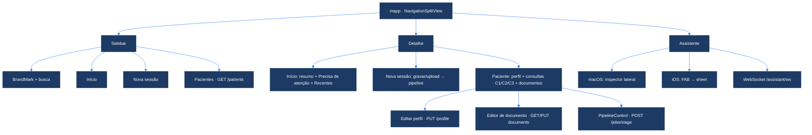
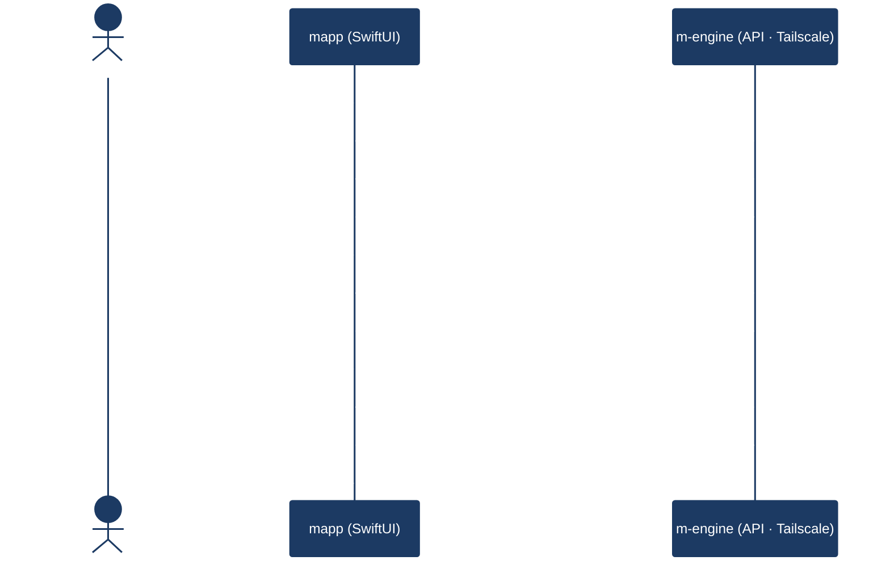

# mapp — cliente SwiftUI do m-engine (macOS + iOS)

**mapp** (M-app / *manifold app*, um trocadilho com *map* / mapa) é o aplicativo
cliente do pipeline clínico. O nome é deliberado: separa o **cliente** (esta app
SwiftUI, `ui-swift/`) do **servidor** (o **m-engine** — backend Python, pasta
`m_engine/`), evitando confundir as duas pontas do sistema.

- **mapp** é a *superfície de cliente*: telas, navegação, edição, gravação.
- **m-engine** é o *servidor/pipeline*: STT, normalização, ASL · VDLP · GEM,
  BIRP, SOAP, armazenamento dos prontuários (PHI) e a API HTTP/WebSocket.

> **Fronteira rígida.** O mapp consome **somente a API do m-engine** (alcançada
> pela rede privada **Tailscale**). Ele **nunca** toca em PHI, disco do
> servidor ou no pipeline diretamente — tudo passa por endpoints. Se a API não
> expõe, o mapp não faz.

---

## O que é o mapp

Um cliente SwiftUI **cross-platform** construído sobre **um único conjunto de
fontes** em [`MEngine/`](MEngine/):

| Plataforma | Como é construído | Empacotamento |
|---|---|---|
| **macOS** (desktop) | **SwiftPM** (`Package.swift`) | `M-Engine.app` montado a partir do binário `swift build` |
| **iOS / iPadOS** | **xcodegen** (`project.yml`) → Xcode | `MEngine-iOS.xcodeproj` assinado e instalado no device |

O código é o mesmo nas duas plataformas. Os poucos pontos específicos vivem sob
`#if os(iOS)` / `#if os(macOS)` — por exemplo:

- **Assistente**: no macOS abre como **inspector lateral** (coluna direita); no
  iOS abre por um **botão flutuante (FAB)** que apresenta um **sheet**
  (`ContentView.swift`).
- **`ActionLabel`**: só-ícone no iOS, ícone + texto no macOS (`HealthOSTheme.swift`).
- **`BrandMark`**: `NSImage` no macOS, `UIImage` no iOS.
- **Teclado / autocapitalização**: `KeyboardKind` e `Autocap` resolvem para
  `UIKeyboardType` / `TextInputAutocapitalization` apenas no iOS.
- Recursos exclusivos do macOS (`Info.plist`, `AppIcon.icns`) são excluídos do
  build iOS pelo `project.yml`.

Deployment targets: **macOS 14+** (`Package.swift`) e **iOS 17+** (`project.yml`).

---

## Telas / superfícies

A casca é uma `NavigationSplitView`: **sidebar** (marca + busca + navegação) à
esquerda, **detalhe** ao centro e o **assistente** à direita (macOS) ou sob
demanda (iOS). Definida em [`ContentView.swift`](MEngine/ContentView.swift).

### Início — dashboard *content-first*
[`HomeView.swift`](MEngine/HomeView.swift)

Redesenhado para mostrar **o que o clínico usa**, não contadores de vaidade:

- **Tira de resumo** discreta no cabeçalho (pacientes · consultas · análises ·
  a revisar) — números calmos *inline* (`InlineStat`), nunca grandes "praças".
- **Precisa de atenção** — consultas sem nenhuma análise clínica derivada
  (têm transcrição/normalização, mas nenhum artefato como BIRP/ASL/VDLP/GEM/SOAP).
  Atalho direto para rodar o pipeline na ficha do paciente.
- **Consultas recentes** — as mais recentes de **todo o arquivo**, em linhas com
  *hairlines* (`HairlineList`), com chips de estado do pipeline por consulta.
- **Atalhos** silenciosos (Novo paciente · Nova sessão) e um **pill de saúde do
  sistema** (Online / Offline) a partir do `GET /healthz`.

### Pacientes — detalhe e CRUD
[`PatientsView.swift`](MEngine/PatientsView.swift)

A ficha do paciente, identificado por um **slug** estável e exibido pelo
**nome de exibição**:

- **Cabeçalho**: avatar, nome, slug, capsules (nº de consultas, idade, telefone).
- **Perfil editável** (`ProfileEditorView`): nome de exibição, nome completo,
  CPF, telefone, idade — salvo via `PUT /patients/{slug}/profile`.
- **Consultas C1/C2/C3…**: cada consulta tem data, fonte e a lista de
  **documentos** (`.md`). Tocar num documento abre o editor.
- **Editor de documento** (`DocumentEditorView`): alterna entre
  **pré-visualização** (Markdown renderizado) e **edição** (`TextEditor`); salva
  via `PUT …/documents/{nome}` e mostra "Salvo · N bytes".
- **PipelineControl** (por consulta): dispara stages individuais
  (`transcribe`, `normalize`, `asl`, `dimensional`, `gem`, `birp`,
  `soap_trajetorial`, `soap_longitudinal`, `pipeline`) via `POST /jobs/{stage}`,
  escolhe o modelo (Claude Code / Opus / Sonnet) e acompanha cada job por polling
  (~2 s) com StatusPill (na fila · processando · completo · erro).
- **CRUD com confirmação**: criar paciente / consulta / documento, **importar
  arquivo** arbitrário, e apagar (soft-delete → lixeira) com
  `confirmationDialog`. No iOS, *swipe actions*; no macOS, *context menu*.

Folhas auxiliares: [`NewPatientView`](MEngine/NewPatientView.swift),
[`NewConsultationView`](MEngine/NewConsultationView.swift),
[`NewDocumentView`](MEngine/NewDocumentView.swift),
[`EditPatientView`](MEngine/EditPatientView.swift).

### Nova sessão — gravar/upload → pipeline
[`IngestView.swift`](MEngine/IngestView.swift) (`NewSessionView`)

- **Gravar** áudio (`AudioRecorder`, `.m4a`/AAC) ou **selecionar arquivo**.
- **Opções**: modelo (Padrão por stage / Opus / Sonnet / Claude Code) e toggle
  **Análise profunda** (liga o ramo ASL → VDLP → GEM → SOAP).
- **Enviar e processar**: `POST /audio` → `POST /jobs/pipeline` → polling
  (~5 s) do job até concluir, com uma legenda visual dos stages
  (STT → PROC → BIRP ∥ ASL · VDLP · GEM · SOAP).

### Assistente — chat
[`AssistantChatView.swift`](MEngine/AssistantChatView.swift)

Chat persistente com o agente do m-engine via **WebSocket** (`/assistant/ws`).
Coluna direita no macOS (inspector), sheet no iOS. Faz *streaming* das respostas,
mostra chamadas de ferramenta (frames `tool`) e replay do histórico. A conexão é
gerida por `AssistantSession` em [`APIClient.swift`](MEngine/APIClient.swift).

### Ajustes
`SettingsView` (em `ContentView.swift`): aba **Conexão** (URL da API + API key
opcional + "Testar conexão") e aba **Profissional** (nome, especialidade,
registro CRM/RQE, clínica, notas — `GET/PUT /professional`, compartilhado entre
iOS e macOS como contexto do assistente).

---

## Design system (healthOS)

Tokens portados para SwiftUI nativo em
[`HealthOSTheme.swift`](MEngine/HealthOSTheme.swift). Espelha o bundle
*healthdrive* (HDrive v2); a separação de superfícies é **content-first** (linhas
sutis em vez de vidro pesado).

| Eixo | Implementação |
|---|---|
| **Cores** | `enum HOS` — marca (`navy #1C3A63`, `blue #3B82F6`, `ink #1C2533`), *stage tints* (STT · PROC · SPEECH · ASL · VDLP · GEM), estados semânticos (complete / running / review / pending / error / degraded / queued) |
| **Tipografia** | `extension Font` — `.hosLargeTitle` … `.hosCaption`, `.hosMono`, `.hosStat()` → **SF Pro / SF Pro Rounded / SF Mono** (system-first, sem fontes embarcadas) |
| **Elevação** | Hierarquia: **recess** (`recessedField`, wells/inputs) < **resting** (`healthCard`) < **raised** (`raisedCard`, popovers/destaque) < **overlay** (`overlaySurface`, sheets). Liquid Glass thin/regular/thick opt-in |
| **Hairlines** | `HOS.divider` / `HOS.hairline` — a separação vem da **linha**, não da sombra |
| **Marca** | `BrandMark` = logo **M** (AppIcon), com fallback SF Symbol |

**Componentes reutilizáveis** (todos em `HealthOSTheme.swift`): `StatusPill`
(capsule por estado/stage), `StatCard`, `InlineStat`, `HairlineList`,
`SectionHeader`, `ActionLabel`, `BlueWash`.

**Princípios**: **SF Symbols** canônicos; conteúdo **PT-BR** sóbrio; **estados,
não adjetivos** (uma consulta está "Sem análise" / "processando", não "ótima");
sensibilidade *light* e refinada, grade de 8 pt.

---

## Como roda

A URL base da API vive em [`AppSettings.swift`](MEngine/AppSettings.swift)
(`@AppStorage`), com **default no IP Tailscale** do servidor m-engine
(`http://100.105.208.96:8000`). Ajustável em tempo de execução em **Ajustes →
Conexão**.

### macOS (SwiftPM)

```bash
cd ui-swift
swift build -c release
# monte o bundle M-Engine.app a partir do binário em .build/release
# (o Info.plist é embutido no binário via sectcreate — ver Package.swift)
```

O `Info.plist` é injetado no binário (NSMicrophoneUsageDescription e
NSAppTransportSecurity para HTTP na tailnet). `M-Engine.app` e `.build/` não vão
ao git; o versionado é o `AppIcon.icns` em `MEngine/`.

### iOS / iPadOS (xcodegen → Xcode)

```bash
cd ui-swift
xcodegen generate                 # gera MEngine-iOS.xcodeproj a partir de project.yml
open MEngine-iOS.xcodeproj
```

No Xcode: **selecione o device** → confirme o **Team** (Personal/conta) →
**Cmd+R**. O `project.yml` **fixa `DEVELOPMENT_TEAM`** e
`CODE_SIGN_STYLE: Automatic` para que a assinatura do device sobreviva a cada
`xcodegen generate` (o `Info-iOS.plist` é **gerado** — não edite à mão).

> **Rede.** A API roda em HTTP texto-puro na tailnet (IP `100.x`). O ATS está
> configurado com **apenas** `NSAllowsArbitraryLoads` (sem
> `NSAllowsLocalNetworking`, que reativaria o ATS e causaria erro `-1022`).

---

## Fronteira / contrato com o m-engine

O mapp depende **exclusivamente** dos endpoints da API. O contrato canônico
(schemas, payloads, stages) é mantido no backend — veja
[`../docs/API.md`](../docs/API.md) e [`../ARCHITECTURE.md`](../ARCHITECTURE.md).
Os DTOs Swift em [`Models.swift`](MEngine/Models.swift) espelham os modelos
Pydantic de `m_engine/api.py` e decodificam de forma defensiva (toleram variação
de schema).

### Endpoints consumidos por `APIClient`

| Método / rota | Uso no mapp |
|---|---|
| `GET /healthz` | Pill de saúde do sistema / "Testar conexão" |
| `POST /audio` | Upload de áudio (multipart, campo `file`) |
| `POST /jobs/pipeline` | Dispara o pipeline completo (`audio_path`, `deep`, `model?`) |
| `POST /jobs/{stage}` | Enfileira um stage isolado (`patient_id`, `date`, `model?`, `force`) |
| `GET /jobs/{id}` | Polling de status do job |
| `GET /stages` | Lista de stages (com fallback estático no PipelineControl) |
| `GET /patients` | Listagem (slug · nome · nº de consultas) |
| `POST /patients` · `DELETE /patients/{slug}` | Criar / apagar (soft-delete) paciente |
| `GET` · `PUT /patients/{slug}/profile` | Ler / editar perfil |
| `GET /patients/{slug}/info` | Resumo do dossiê (CID, medicamentos, tópicos) |
| `GET` · `POST` · `DELETE /patients/{slug}/consultations[/{cid}]` | Consultas C1/C2/C3 |
| `GET` · `PUT · POST · DELETE …/{cid}/documents[/{nome}]` | Documentos Markdown (ler/salvar/criar/apagar) |
| `POST …/{cid}/files` | Importar arquivo arbitrário (multipart) |
| `GET` · `PUT /professional` | Perfil do profissional (contexto do assistente) |
| `WS /assistant/ws` | Chat do assistente (streaming) |

> A API hoje **não exige autenticação**; o campo *API key* em Ajustes envia
> `Authorization: Bearer …` apenas para o caso de um proxy/gateway na frente.

---

## Árvore de navegação



## Abrir paciente → carregar perfil + consultas → editar documento



---

## Mapa de arquivos (`MEngine/`)

| Arquivo | Papel |
|---|---|
| `MEngineApp.swift` | `@main` App + `WindowGroup` |
| `ContentView.swift` | Casca: `NavigationSplitView`, sidebar, assistente (inspector/FAB), `SettingsView` |
| `HomeView.swift` | Início (dashboard content-first) |
| `PatientsView.swift` | Detalhe do paciente, `PipelineControl`, `DocumentEditorView`, `ProfileEditorView` |
| `IngestView.swift` | Nova sessão (`NewSessionView`) |
| `AssistantChatView.swift` | Chat do assistente (WebSocket) |
| `NewPatientView` · `NewConsultationView` · `NewDocumentView` · `EditPatientView` | Folhas de criação/edição |
| `APIClient.swift` | Cliente async da API + `AssistantSession` (WebSocket) |
| `Models.swift` | DTOs Codable (espelham `m_engine/api.py`) + `PatientInfo` · `ModelChoice` · `Professional` |
| `AppSettings.swift` | URL da API + API key (`@AppStorage`) |
| `AudioRecorder.swift` | Gravação `.m4a`/AAC (AVAudioRecorder) |
| `HealthOSTheme.swift` | **Design system healthOS**: tokens, elevação, componentes, `BrandMark` |
| `MarkdownText.swift` | Renderizador Markdown leve |

> Os fontes em `MEngine/` são SwiftUI puro; não há `.xcodeproj` versionado para
> macOS. Erros do editor do tipo "Cannot find type 'APIClient'…" são do SourceKit
> analisando arquivos isolados — somem quando todos os `.swift` estão no mesmo
> target.
